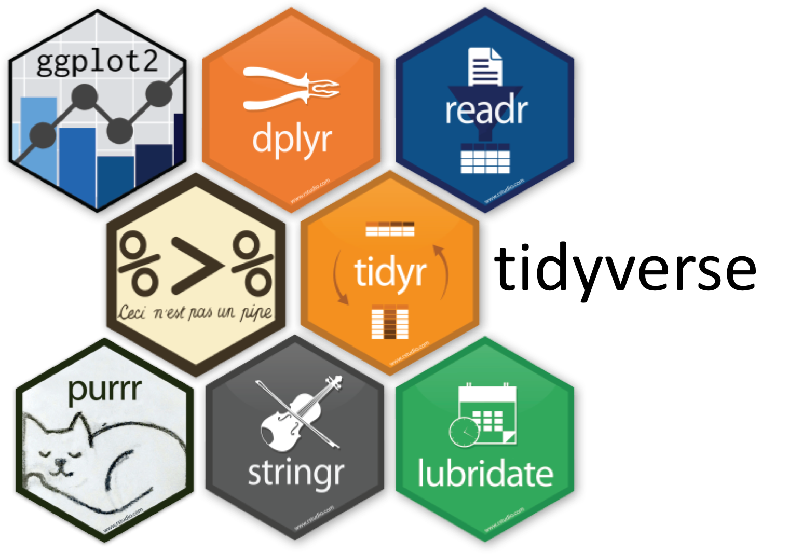

```{r setup, include=FALSE}
knitr::opts_chunk$set(echo = TRUE)
```

# The R Language

R is a scripting language and a very powerful tool for data analysis and presentation, primarily due to the huge user base and their dedication to developing free and open source libraries/packages covering a vast range of different knowledge domains:

- Regression
- Machine Learning
- Image Analysis
- Network Analysis

<p>

The Comprehensive R Archive Network [(CRAN)](cran.r-project.org) is the canonical repository for R packages, note that almost all* packages hosted on CRAN may be used within a Shiny app.

*\*Packages dependent on parallel or distributed computing are unlikely to be supported, contact shinyapps-support@rstudio.com with any questions*

# Learning R

There are thousands of online resources for learning R, many are available for free.

Two I'd like to personally endorse are:

- [Datacamp.com](datacamp.com) provides an excellent **free** introductory course to the R language, I thoroughly recommend it with one caveat - skip the section on matrices.

- [Lynda.com](lynda.com) (and LinkedIn Learning) is a subscription learning platform that covers a vast range of topics. I'm a Lynda.com author and am contracted to produce introductory courses for R, you can get a free 3-month trial for Lynda here XXXX

# The R Console

R is the name of the programming language and *console* within which many users of R write and evaluate their code.

To use R on your local machine you must [download](https://cran.r-project.org/bin/windows/base/) and install the R Console, it's available on Windows, OS X and Linux.

Like all consoles, this application provides [only] the following functionality:

<div class="row">
  <div class="col-md-6">
- Write code and script files
- Evaluate code and script files
  </div>
  <div class="col-md-6">

  </div>
</div>

# 

RStudio is a free, open-source IDE (integrated development environment) that provides an extremely powerful and friendly interface for developing with R.

IDEs make it easier to manage your programming, providing the following features:

- Interactive overview of your variables and datasets
- Interactive file explorer for managing file dependencies
- Tabbed script interface, allowing code to be split into smaller, more manageable files
- Integrated documentation for the primary language of the IDE

# 

RStudio, however, provides much more exciting features on top of a standard IDE:

- Integrated visualisation previews, including interactive htmlwidgets
- Support for creating, previewing and deploying interactive Shiny apps
- A powerful literate programming interface through RMarkdown*
- Tools for developing R packages

*more on RMarkdown after some actual code.


# Base R and R Packages

When R is installed on your computer the machinery necessary to run R code is added to your computer and a number of "base" packages including; `stats`, `utils` and `graphics`. 

See <a href="http://stackoverflow.com/a/9705725/1659890">stackoverflow.com/a/9705725/1659890</a> for further details.

These packages will not get you far in life, unless you're prepared to write a **lot** of code from scratch. 

But you can guarantee* that any code samples you see online referring to "base R" only will work without having to install additional libraries.

# Installing Packages

If a package is on CRAN then it is "installed" onto your using the following code, you're advised to write this directly into the console and *not* into your documents

<div class="incremental"> 
- You (probably) don't want to reinstall a library everytime your script is evaluated

```{r, eval=FALSE}
install.packages("ggplot2")
```

Once a library is installed, functions can be accessed using `ggplot::geom_point()`.

However, libraries are designed to be used after being loaded:

```{r, eval=FALSE}
library(ggplot2)
```
</div>

# Warning on Packages

While packages are incredibly useful, it is important not to offload all thought/development to packages for three important reasons:

- The package might be written poorly (unoptimised, or with incorrect assumptions)
- The package may well become unsupported in the future if the developer does not maintain it
- Not all packages are designed to play nicely with one another, manipulating your code to play nice with `obnoxiousR` might be harder than simple writing in base R

# RStudio-backed Packages

<div class="row">
  <div class="col-md-5" style="vertical-align:middle;">

  </div>
  <div class="col-md-7">
- The "tidyverse" is a collection of packages maintained by RStudio devs [particularly Hadley Wickham]
- tidyverse packages play extremely nicely together
- tidyverse packages are extremely useful for preparing data for interactive visualisations
- tidyverse packages are highly optimised, often specifically around nitpicky details of bse R (readr is a good example of this)
- tidyverse is the backbone of the recently published, free online book [R for Data Science](http://r4ds.had.co.nz)
  </div>
</div>

# Tidyverse package workflow

<div class="row">
  <div class="col-md-5" style="vertical-align:middle;">

  </div>
  <div class="col-md-7">
- Import with `readr`
- Reshape with `tidyr`
- Filter, modify and query with `dplyr`
- Visualise with `ggplot` (but that's not interactive...)
  </div>
</div>

<p>
RStudio has links to a fantastic cheatsheet on the tidyverse (the complicated reshaping/filtering part of it) available under Help > Cheatsheets

# Installing the tidyverse

There are currently over 15 packages in the tidyverse, it's a pain installing each of them separarely. So RStudio have made everything easy to manage via the `tidyverse` package:

```{r}
# install.packages("tidyverse")
library("tidyverse")
tidyverse_packages()
```


# R Syntax Catch-up

We're going to be using what to some users is considered advanced R programming during today's session, but often experienced R users get tripped up over brackets. It's good to cement into your head what each bracket is for so that when you read code you know what's going on:

- Round brackets () 

<div class="incremental"> 
Encapsulate the arguments for a function, in the case of `rep("Hello World", 2)` the round brackets encapsulate the two arguments passed to the function `rep` - arguments are therefore deliminated by commas.
</div>

- Square brackets [] 

<div class="incremental"> 
Used for extracting parts (rows, columns, individual elements) from data structures - that's there only use
</div>

- Braces {} 

<div class="incremental"> 
Used for containing expressions - when writing mathematical expressions by hand round brackets are usually used for controlling precedence (order of operations), but in R you should write 2*{x+1}^2.


Braces are necessary where *more than one thing* is being done in an individual argument

```{r}
rep(
  "strings",
  {
    no1 <- 2
    no1 +3
  }
)
```
</div>
