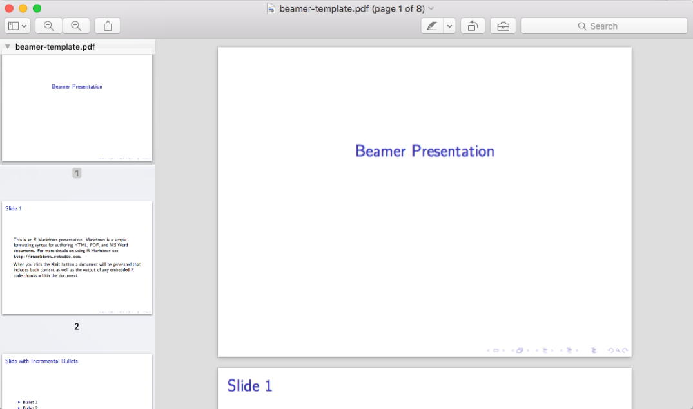
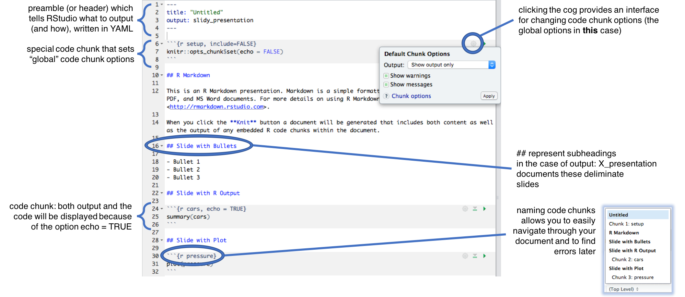
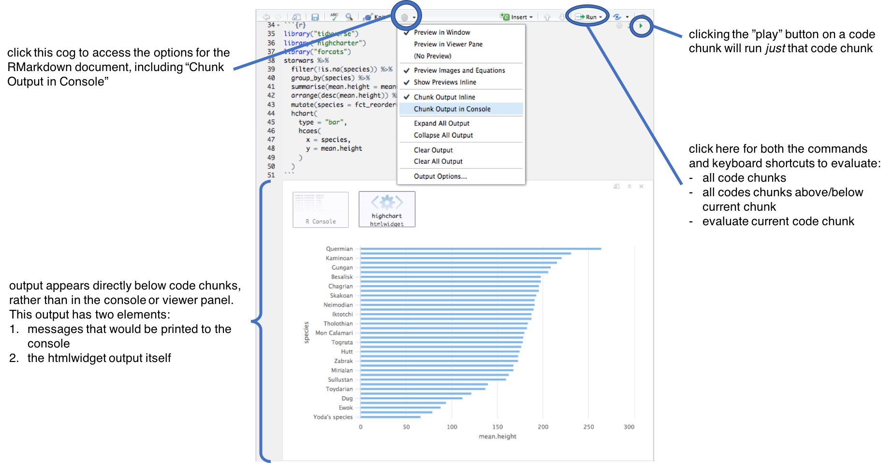
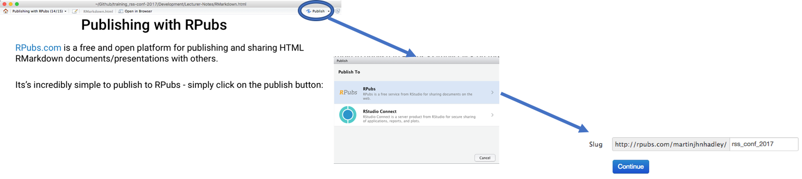

## Literate programming

Literate programming environments try to minimise the potential for undocumented/write-only code by providing a simple method of combining text, images and other output to completely explain the function of the code alongside the code.

## Literate programming: RMarkdown

RStudio provides an amazing literate programming environment in the form of RMarkdown. A simple document-orientated approach to coding that allows even htmlwidgets to be included directly alongside code.

There are three different kinds of document that can be created with RMarkdown:

<center></center>

- PDF files are useful for when writing academic reports, lecture notes or other material that must be printed
- HTML files are useful when wanting to share your content online, perhaps via RPubs which will be discussed later
- Generating word files from RMarkdown is beyond the scope of this course

All of the materials for this training course were written in RMarkdown.

## What is Markdown?

Markdown is a very simple and widely used markup language created by John Gruber - it allows documents to be described and then generated through an interpreter.


There are many different flavours of Markdown but they all share the same basic syntax, which can be spit into the following types of actions:

- Laying out documents

- Formatting Text

- Including images and hyperlinks

- Include code and code output


Every *flavour* of Markdown has slightly different implementations, before we get into the specifics of "RMarkdown" let's create a document that allows us to generate output from RMarkdown.

## Presentations with RMarkdown

This course focuses on presentations rather than reports, as I think it's quite exciting to be able to include interactive content within data-driven presentations. 

There are three types of presentations you can create:

<!--  -->
<!--  -->
<!--  -->

<div class="row">
  <div class="col-sm-3"></div>
  <div class="col-sm-9">Beamer outputs a PDF file with buttons that can be used in most PDF viewers for navigating through slides.</div>
</div>
<div class="row" style=style="align-items:center;">
  <div class="col-sm-3"></div>
  <div class="col-sm-9" style="align-items:center;">ioslides outputs a highly stylised HTML file with a transition effect between slides and a "letter boxing" effect around your content.
  Contents can be shown by pressing the C key</div>
</div>
<div class="row">
  <div class="col-sm-3"></div>
  <div class="col-sm-9">slidy outputs a HTML file with significantly more flexibility than ioslides.
  Contents can be shown by pressing the C key.</div>
</div>

## Template documents

No matter which document type you choose, you'll find yourself with a template documet that looks very much like this:



## Evaluating code chunks while writing

When writing your presentations, you will want to run your code to ensure that it works. By default, RMarkdown documents behave very differently from R script files:



## Formatting text in RMarkdown

Basic text formatting is achieved using syntax that you may have used in other text editors, or in comment sections on websites:

\*italics\*

\*\*bold\*\*

Bullet point and enumerated lists are also added easily as follows:

\- Bullet point 1

\- Bullet point 2

1. First Numbered Item

2. Second Numbered Item

It's important to remember that as your text is first interpreted as code, rather than text to display, it's necessary to "escape" characters that would otherwise be interpreted - for instance \\\*this isn't italic\\\*

## URLS and Images

URL links are simply written as

`[text to show](http://google.com)`

Images can be embedded into RMarkdown documents from the web or from your local machine - the exercises will introduce you to the relative filepaths necessary to include local files.

``

## HTML for Power Users

Markdown is great for quickly specifying your document/presentation layout, but it is not designed to be flexible or extensible - it's a minimal set of instructions for styling your content.

If you're generating HTML from RMarkdown it's possible to simply write HTML directly in your .rmd files.

Slidy and ioslides both utilise the Bootstrap CSS framework so it's easy to include responsive content in your presentations. For instance you may have noticed this earlier in the course, which uses the [awesome] Bootstrap grid framework, which you can read about here: https://v4-alpha.getbootstrap.com/layout/grid/

<div class="col-md-6">
**Charts from scratch**

- Instantiate a highcharter object with `highchart`
- Add series with `hc_add_series` 
- Ensure column names within `hc_add_series` are consistent with the Highchart JS library's requirements.

</div>

<div class="col-md-6">
**Charts with magic**

- Provide a tibble to the `hchart` function
- Specify the chart aesthetics using `hcaes`
- Provide column names as "naked variables"

</div>

## htmlwidgets in RMarkdown (I)

htmlwidgets can fairly easily be embedded into RMarkdown documents, however there are some things to be wary of.

For instance, the zoom buttons in leaflet maps unfortunately result in a slidy presentation changing slides:

```{r, eval=TRUE, message=FALSE, warning=FALSE}
library("leaflet")
quakes %>%
  leaflet() %>%
  addTiles() %>%
  addCircleMarkers()
```

## htmlwidgets in RMarkdown (II)

Sometimes there are simple modifications you can make to htmlwidgets to make them play nicely with your slides, like dropping the zoom controls:

```{r, eval=TRUE, message=FALSE, warning=FALSE}
quakes %>%
  leaflet(options = leafletOptions(zoomControl = FALSE)) %>%
  addTiles() %>%
  addCircleMarkers()
```

## htmlwidgets in RMarkdown (III)

There's a package called `widgetframe` which is designed to make it easier to embed htmlwidgets into RMarkdown documents (and other places) without conflicts between the presentation and the iframe which contains the widget itself.

```{r, eval=FALSE, message=FALSE, warning=FALSE}
library("leaflet")
library("widgetframe")
l <- quakes %>%
  leaflet() %>%
  addTiles() %>%
  addCircleMarkers()
frameWidget(l)
```

```{r, eval=TRUE, echo=FALSE, message=FALSE, warning=FALSE}
library(leaflet)
library(widgetframe)
l <- quakes %>%
  leaflet() %>%
  addTiles() %>%
  addCircleMarkers()
l
```

## Publishing with RPubs

[RPubs.com](rpubs.com) is a free and open platform for publishing and sharing HTML RMarkdown documents/presentations with others.

Its's incredibly simple to publish to RPubs - simply click on the publish button:



Note that while documents hosted on RPubs are made public, the underlying code/.rmd files cannot be downloaded by others.

