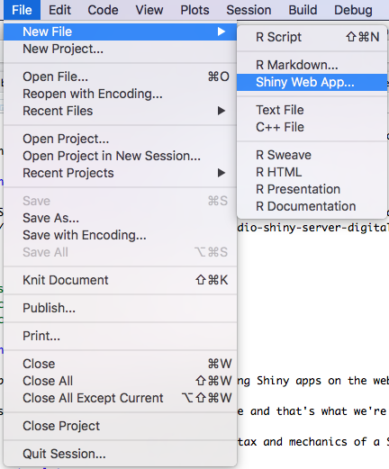
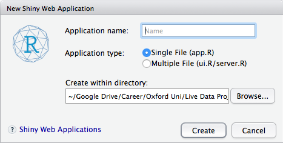
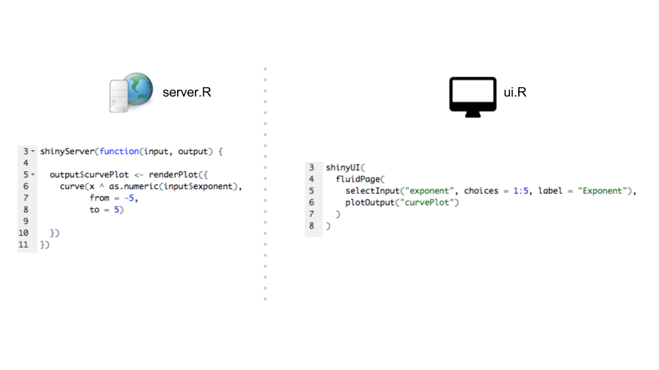
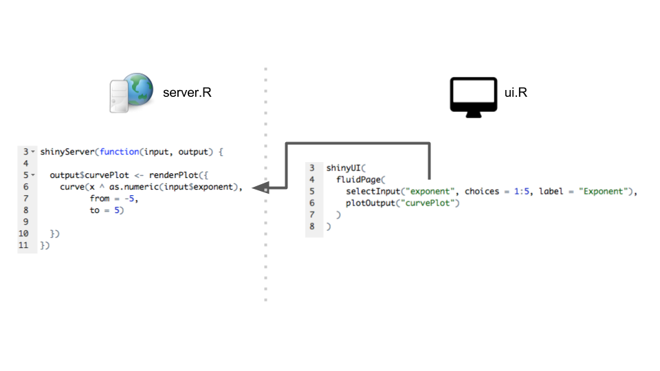
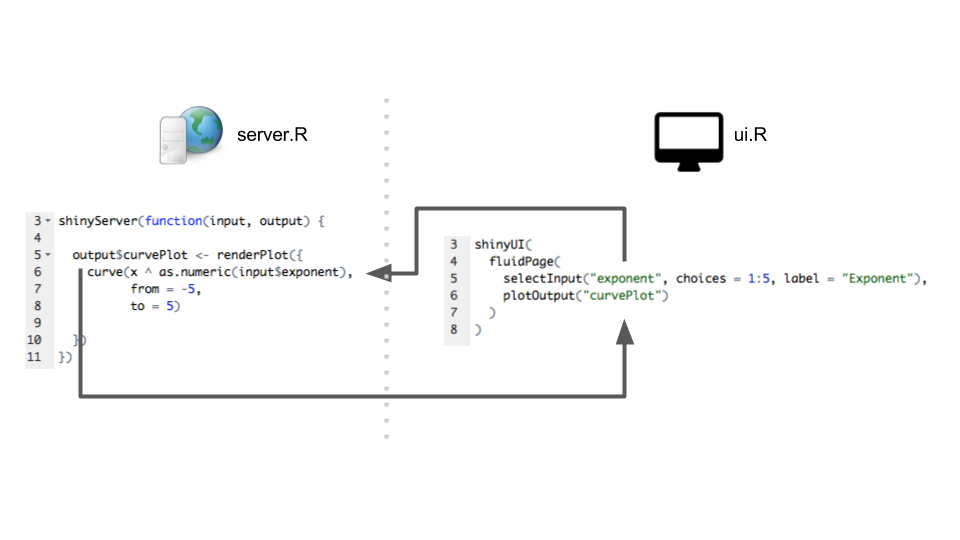
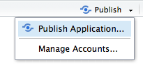
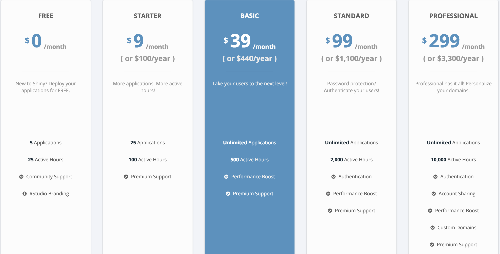
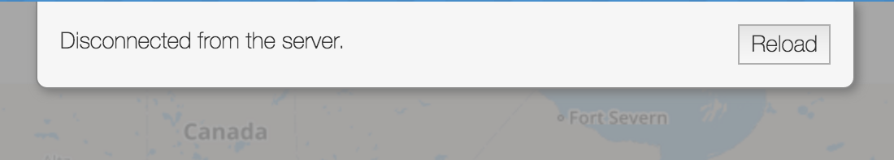

## Shiny apps

Shiny is a "self-contained" web framework for building interactive web elements with R code.

Why might you want to use Shiny?

<div class="incremental"> 
`htmlwidgets` allow you to create **isolated** visualisations, with Shiny you can build highly interactive web applications including inter-dependent visualiations and a whole host of different types of controls.

Here are some examples of what you can build, moving from simple to complicated:

>- http://shiny.rstudio.com/gallery/
>- https://livedataoxford.shinyapps.io/CRUK-Collaboration-Network/
>- https://daattali.com/shiny/cfl/

</div>

## Shiny apps on your local machine

To build Shiny apps on your local machine you need to install the necessary machinery for the web framework - all of which is contained within the `shiny` library.

When a Shiny app is running on your local machine a local web-server allows you to interact with the application - to deploy Shiny apps to the web you need to have Shiny Server running somewhere.

## Shiny apps shared on the web

Shiny Server [Open Source] is free and can be set-up on a server fairly easily, and there's a great tutorial here: http://deanattali.com/2015/05/09/setup-rstudio-shiny-server-digital-ocean/

BUT.

>- This isn't actually fairly easy
>- It costs money
>- It costs time to maintain

## Shiny apps shared on the web

[shinyapps.io](shinyapps.io) is a hosted solution for sharing Shiny apps on the web, run by RStudio.

There's a free tier of the service available and that's what we're going to be using later in this course.

Before that - let's introduce the basic syntax and mechanics of a Shiny app.

## Shiny templates

RStudio includes two templates for creating Shiny apps which are available from File -> New, however these are fairly advanced templates to begin with.

<div class="row">
  <div class="col-md-1"></div>
  <div class="col-md-3"><center></center></div>
  <div class="col-md-8"><center></center></div>
</div>
<br>
It is also important to identify the difference between "single-file" and "multi-file" apps:

>- Single-file apps are easy to write small interactive examples, but cannot [easily] be deployed to shinyapps.io
>- Multiple-file apps are what you want. 

## Shiny templates

The exercise folder contains a subdirectory called "shiny_basic", we're going to use this to introduce the structure of a shiny app by building the following interactive app:

```{r, exponent_curve_example, echo=FALSE}
shinyApp(
  ui = fluidPage(
    selectInput("exponent", choices = 1:5, label = "Exponent"),
    plotOutput("curvePlot")
  ),
  server = function(input, output){
    output$curvePlot <- renderPlot({
      curve(x^as.numeric(input$exponent), from = -5, to = 5)
    })
  }, options = list(width = "100%", height = "800px")
)
```

## How Shiny works (I)

<center></center>

## How Shiny works (II)

<center></center>

## How Shiny works (III)

<center></center>

## render* and output* (IIII)

Every type of output you wish to display in a shiny app has a corresponding rendering function:

<!-- Render | Output -->
<!-- ------------- | ------------- -->
<!-- output$my_ui <- renderUI | uiOutput("my_ui") -->
<!-- output$my_plot <- renderPlot | plotOutput("my_plot") -->
<!-- output$my_text <- renderText | verbatimTextOutput("my_text") -->

```{r, echo = FALSE, results = "asis"}
render_output_pairs <- data.frame(
  "render" = c("output$my_ui <- renderUI", "output$my_plot <- renderPlot", "output$my_text <- renderText"),
  "output" = c('uiOutput("my_ui")','plotOutput("my_plot")','verbatimTextOutput("my_text")')
)
DT::datatable(render_output_pairs, colnames = c("render*", "*output"), style = "bootstrap", filter = "none", rownames = FALSE,options = list(dom = 't'))
```

## Exercises (basic app: 10mins)

Exercises_ShinyBasic_basic.Rmd

## Publishing to shinyapps.io

Publishing your Shiny app to shinyapps.io is incredibly simple if you're using RStudio, simply click on the publish button.

<center></center>

## Registering for a shinyapps.io account

In the exercises I would like you to register for an account and connect your RStudio install to the account, but before hand let us consider how the free account works.

<center></center>

## shinyapps.io: 5 applications

Free accounts entitle you to 5 active applications.

>- Active applications are those that can be "viewed" by others
>- Archived applications are unaccessible to viewers
>- Deleted applications are deleted

## shinyapps.io: 25 active hours

All accounts have a limited number of "active hours" - this is the time during which an app is running.

>- When a shiny app is first loaded a timer starts counting down the "active hours"
>- Multiple users can connect to the same "instance" of a shiny app and do not consume additional active hours.
>- Heavy loads will spawn new instances that will consume n * active hours

## shinyapps.io: 25 active hours

>- There is a disconnection timeout [default: 15 minutes] after which a browser is disconnected from the shinyapps.io server. 
>- There is an idle timeout [default: 15 minutes] after an application is closed, designed to keep your app available for the next user.

<div class="incremental">
<center></center>
</div>

## Exercises (publishing: 10 mins)

Exercises_ShinyBasic_publishing.Rmd

## How does Shiny *really* work?

Much of the Shiny library simply provides wrappers for writing HTML:

<div class="incremental"> 
```{r}
library(shiny)
fluidPage()
```

```{HTML}
<div class="container-fluid"></div>
```


Interactive portions of a Shiny app also include JavaScript, which is awaiting a value from the server.

```{r, eval = F}
selectInput("my_input_name", "label", choices = c("a","b"), selected = "a")
```

```{HTML}
<div class="form-group shiny-input-container">
  <label class="control-label" for="thisVar">label</label>
  <div>
    <select id="thisVar"><option value="1" selected>1</option>
<option value="2">2</option>
<option value="3">3</option></select>
    <script type="application/json" data-for="thisVar" data-nonempty="">{}</script>
  </div>
</div>
```

This provides a clue as to how to `htmlwidget` visualisations are included Shiny apps.
</div>

## htmlwidgets and Shiny apps

All *good* `htmlwidget` libraries include at least minimal support for shiny apps:

- renderWidget
- widgetOutput

Most libraries also include the ability to detect click location/object within a htmlwidget, or to perform actions on a widget in reaction to an input change.

## Selected markers in leaflet maps

The leaflet library has excellent support for shiny, relatively well documented here http://rstudio.github.io/leaflet/shiny.html and demonstrated below:

```{r, message=FALSE, warning=FALSE, echo=F}
library(leaflet)
library(readr)
library(shiny)
locations <- read_csv("https://ndownloader.figshare.com/files/5449670")

shinyApp(
  ui = fluidPage(uiOutput("marker_click"),
                 leafletOutput("my_map")),
  server = function(input, output) {
    
    output$my_map <- renderLeaflet(leaflet(locations) %>%
                                     addTiles() %>%
                                     addCircleMarkers())
    
    output$marker_click <- renderUI({
      paste(
        "marker click coordinates:",
        input$my_map_marker_click$lat,
        ",",
        input$my_map_marker_click$lat
      )
    })
    
  }
)
```

<div class="incremental">

Any output object generated with `renderLeaflet` is capable of sending the following input values back:

input$objectname_marker_mouseover

```{r, eval=F}
output$my_map <- renderLeaflet(leaflet(locations) %>%
                                 addTiles() %>%
                                 addCircleMarkers())

output$marker_click <- renderUI({
  paste(
    "marker click coordinates:",
    input$my_map_marker_click$lat,
    ",",
    input$my_map_marker_click$lat
  )
})
```

</div>

## Where is the library needed?

When deploying apps containing htmlwidgets - it is vital that you load the library in both the ui.R and server.R files.

## Exercises (htmlwidgets: 20 mins)

Exercises_ShinyBasic_htmlwidgets.Rmd
