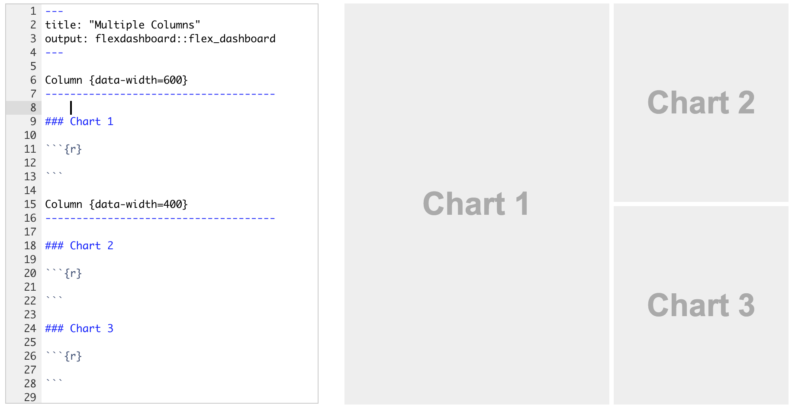

# Shiny Layouts

There are three high-level layouts for shiny apps that can be used easily, these are:

- navbarPage: has a horizontal navigation bar at the top of the page

- sidebarLayout: divides the page into two columns by default 4/12 and 8/12ths of the screen

- tabsetPanel: provides horizontal navigation for within an application

<div class="incremental">

```{r, message=FALSE, warning=FALSE, bootstrap_shiny, echo=FALSE}
library(shiny)
library(leaflet)
library(readr)
locations <- read_csv("https://ndownloader.figshare.com/files/5449670")
shinyApp(
  ui = navbarPage(
    "navbarMenu Example",
    tabPanel("fluidPage",
             fluidPage(
               sliderInput("number.of.data.1", label = "Number of Data", min = 200, max = 1000, value = 500),
               plotOutput("hist_1"),
               leafletOutput("map_1")
             ))
    ,
    navbarMenu("navbarMenu",
                tabPanel("sidebarLayout", 
                         fluidPage(
                           sidebarLayout(
                             sidebarPanel(sliderInput("number.of.data.2", label = "Number of Data", min = 200, max = 1000, value = 500)),
                             mainPanel(tabsetPanel(
                               tabPanel("Histogram",
                                        plotOutput("hist_2")),
                               tabPanel("Other",
                                        leafletOutput("map_2"))
                             ))
                           )
                         )
                         ),
                tabPanel("tabsetPanel", 
                         fluidPage(
                           sidebarLayout(
                             sidebarPanel(sliderInput("number.of.data.3", label = "Number of Data", min = 200, max = 1000, value = 500)),
                             mainPanel(tabsetPanel(
                               tabPanel("Histogram",
                                        plotOutput("hist_3")),
                               tabPanel("Other",
                                        leafletOutput("map_3"))
                             ))
                           )
                         )
                         )),
    collapsible = TRUE
  ),
  server = function(input, output, session){
  
    data.for.histogram <- reactive({
      rnorm(n = input$number.of.data.1, mean = 0, sd = 2)
    })
    
    output$hist_1 <- output$hist_2 <- output$hist_3 <- renderPlot({
      
      data <- data.for.histogram()
      
      hist(data)
    })
    
    output$map_1 <- output$map_2 <- output$map_3 <- renderLeaflet(leaflet(locations) %>%
                                     addTiles() %>%
                                     addCircleMarkers())

    observe({
      val <- input$number.of.data.1
      updateSliderInput(session, "number.of.data.2", value = val)
    })
    
    observe({
      val <- input$number.of.data.1
      updateSliderInput(session, "number.of.data.3", value = val)
    })
    
    observe({
      val <- input$number.of.data.2
      updateSliderInput(session, "number.of.data.1", value = val)
    })
    
    observe({
      val <- input$number.of.data.2
      updateSliderInput(session, "number.of.data.3", value = val)
    })
    
    observe({
      val <- input$number.of.data.3
      updateSliderInput(session, "number.of.data.1", value = val)
    })
    
    observe({
      val <- input$number.of.data.3
      updateSliderInput(session, "number.of.data.2", value = val)
    })
     
  }, options = list(width = "100%", height = "1200px")
)
```
</div>

# 4/12 and 8/12ths of the screen?

Shiny apps use what is known as the "bootstrap" framework to provide "responsive layouts". Bootstrap is incredibly widely used, thorough documentation about the framework is available here: [http://getbootstrap.com/](http://getbootstrap.com/).

Content within bootstrap pages "reflows" as the width of the browser window changes, providing a (hopefully) mobile-friendly layout. One of the fundamental components of the bootstrap framework is the 12 column grid:

```{r, echo = FALSE}
shinyApp(
  ui = fluidPage(
    fluidRow({
      lapply(1:12, function(x)column("text", width = 1))
    })
  ),
  server = function(input, output){
    
  }
)
```

# sidebarLayout

sidebarLayout is very simple to use, simply include it within a `fluidPage`, `fillPage` or `navbarPage`:

```{r, eval = F}
sidebarLayout(
  sidebarPanel(
    sliderInput(
      "slider_value",
      label = "Slider",
      min = 1,
      max = 5,
      value = 3
    )
  ),
  mainPanel(plotOutput("curvePlot"))
)
```


```{r, echo = FALSE}
shinyApp(
  ui = fluidPage(
    sidebarLayout(
      sidebarPanel(
        sliderInput("slider_value", label = "Slider", min = 1, max = 5, value = 3)
      ),
      mainPanel(plotOutput("curvePlot"))
    )
  ),
  server = function(input, output){
    output$curvePlot <- renderPlot(
      curve(sin(x ^ input$slider_value), from = -pi, to = pi)
    )
  }
)
```

# tabsetPanel

tabsetPanel is very simple to use, simply include it within a `fluidPage`, `fillPage` or `navbarPage`:

```{r, eval = F}
tabsetPanel(tabPanel("Plot",
                     plotOutput("curvePlot")),
            tabPanel(
              "More content...",
              fluidPage("More content that requires a sidebarLayout within it...")
            )))
```

```{r, echo = FALSE}
shinyApp(
  ui = fluidPage(
    sidebarLayout(
      sidebarPanel(
        sliderInput("slider_value", label = "Slider", min = 1, max = 5, value = 3)
      ),
      mainPanel(tabsetPanel(
        tabPanel("Plot",
                 plotOutput("curvePlot")),
        tabPanel("More content...",
                 fluidPage(
                   "More content that requires a sidebarLayout within it...",
                   sidebarLayout(
                     sidebarPanel("Recursion"),
                     mainPanel("Examples can become difficult to think of...")
                   )
                 ))
      ))
    )
  ),
  server = function(input, output){
    output$curvePlot <- renderPlot(
      curve(sin(x ^ input$slider_value), from = -pi, to = pi)
    )
  }
)
```

# fluidPage and fluidRow

A `fluidPage` layout scales to completely fill the available browser width, but not the browser height - to achieve that you must use `fillPage`.

While `sidebarLayout` does allow customisation of the `side` and `mainPanel` width it does not allow any more than two columns.

To build interfaces from scratch, you must use `fluidRow` within `fluidPage`, `fillPage` or `navbarPage`:

```{r, eval = F}
fluidRow(
      column(
        sliderInput("slider_value", label = "Slider", min = 1, max = 5, value = 3),
        width = 4),
      column(plotOutput("curvePlot"), width = 4),
      column("Additional content...", width = 4)
    )
```


```{r, echo=FALSE}
shinyApp(
  ui = fluidPage(
    fluidRow(
      column(
        sliderInput("slider_value", label = "Slider", min = 1, max = 5, value = 3),
        width = 4),
      column(plotOutput("curvePlot"), width = 4),
      column("Additional content...", width = 4)
    )
  ),
  server = function(input, output){
    output$curvePlot <- renderPlot(
      curve(sin(x ^ input$slider_value), from = -pi, to = pi)
    )
  }
)
```

# wellPanel

When building interfaces from scratch it is nice to be able to replicate the paneled look of the `sidebarLayout` - this panel is called a `wellPanel`

```{r, eval = F}
wellPanel("Additional content...")
```


```{r, echo=F}
shinyApp(
  ui = fluidPage(
    fluidRow(
      column(
        wellPanel(sliderInput("slider_value", label = "Slider", min = 1, max = 5, value = 3)),
        width = 4),
      column(plotOutput("curvePlot"), width = 4),
      column(wellPanel("Additional content..."), width = 4)
    )
  ),
  server = function(input, output){
    output$curvePlot <- renderPlot(
      curve(sin(x ^ input$slider_value), from = -pi, to = pi)
    )
  }
)
```

# navbarPage

A `navbarPage` is simply constructed of `tabPanel`s and `navbarMenu`s, it provides a horizontal navigation menu at the top of the Shiny app:

```{r}
shinyApp(
  ui = navbarPage(
    "navbarMenu Example",
    tabPanel(
      "fluidPage",
      fluidPage("First tab content")
    )
    ,
    navbarMenu(
      "navbarMenu",
      tabPanel("Child 1",
               fluidPage("some content")),
      tabPanel("tabsetPanel",
               fluidPage("some more content"))
    ),
    tabPanel("Last Tab",
             fluidPage("Even more content")),
    collapsible = TRUE
  ),
  server = function(input, output, session) {
    
  }
)
```

# flexdashboard

It would be remiss of me not to mention the `flexdashboard` library that is designed for easily creating dashboards with RMarkdown and Shiny. I've not used it much myself, because I like having full programmatic control of my content, but it's well worth investigating.


<center><a href="http://rmarkdown.rstudio.com/flexdashboard/index.html"></a></center>

# Exercises (10mins)

