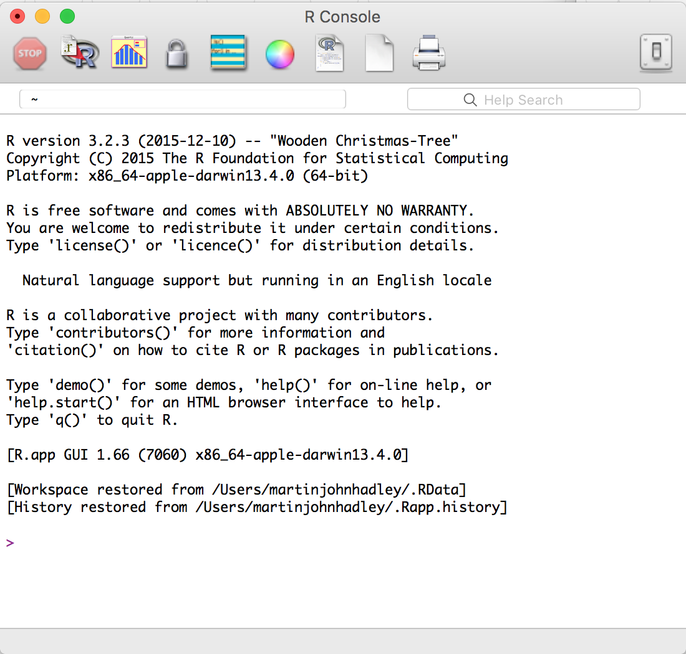
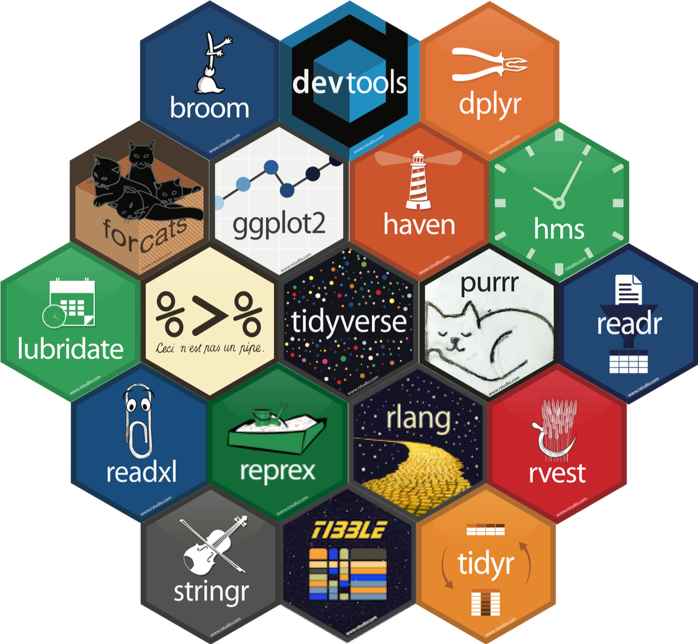

```{r setup, include=FALSE}
knitr::opts_chunk$set(echo = TRUE)
```


# The R Language

Boo yeah

R is a scripting language and a very powerful tool for data analysis and presentation, primarily due to the huge user base and their dedication to developing free and open source libraries/packages covering a vast range of different knowledge domains:

- Regression

- Machine Learning

- Image Analysis

- Network Analysis

<p>

One of the core strengths of R as a tool for data science is its highly active community of users and package developers. 

---

# R and CRAN

Unlike **any** other programming language there is unified system for installing packages **easily on Windows, macOS and Linux**.

This is also where you downloaded R from the in the first place; The Comprehensive R Archive Network [(CRAN)](cran.r-project.org).

---

# R, CRAN and Packages

```{r, include = FALSE}
## Modified script from https://gist.github.com/daroczig/3cf06d6db4be2bbe3368
library("tidyverse")
library("rvest")
library("XML")
start <- Sys.time()
current_cran_contribs <- readHTMLTable(readLines("https://cran.rstudio.com/src/contrib"),
  which = 1, stringsAsFactors = FALSE
) %>%
  setNames(c("icon", "name", "last.modified", "size", "description")) %>%
  as_tibble() %>%
  select(-icon) %>%
  mutate(
    size = ifelse(size == "-",
      NA,
      size
    ),
    description = ifelse(description == "",
      NA,
      description
    )
  ) %>%
  filter(!is.na(name))

current_cran_pkgs <- current_cran_contribs %>%
  filter(!is.na(size))
end <- Sys.time()
```


There are currently (`r Sys.Date()`) **`r prettyNum(nrow(current_cran_pkgs), big.mark = ",")`** packages on CRAN. 

Deciding which packages to use (and trust) can be a daunting part of becoming confident (or perhaps *fluent*) in R.

We'll spend the first part of this morning thinking a little bit about how to pick which packages to use.

---

# Learning R

There are thousands of online resources for learning R, many are available for free.

I personally recommend one resource above all others to folks completely new to R:

> [Datacamp.com](datacamp.com)'s **free** "Introduction to R" course is exceptional at giving the very basics of the R language. Examples are completed in the web browser, so you don't need to guarantee your machine is setup correctly.
> 
> *However*, **skip the chapter on matrices**.

At the end of today I'll remind you about Datacamp and mention a variety of other online resources for getting comfortable with the actual R language.

---

# The R Console

R is the name of the programming language and *console* within which many users of R write and evaluate their code.

To use R on your local machine you must [download](https://cran.r-project.org/bin/windows/base/) and install the R Console, it's available on Windows, OS X and Linux.

---

# The R Console

Like most consoles, this application provides **only** the following functionality:

- Write code and script files

- Evaluate code and script files




---

# 

RStudio is a free, open-source IDE (integrated development environment) that provides an extremely powerful and friendly interface for developing with R.

It's awesome.

---

# 

IDEs make it easier to manage your programming, providing the following features:

- Interactive overview of your variables and datasets

- Interactive file explorer for managing file dependencies

- Tabbed script interface, allowing code to be split into smaller, more manageable files

- Integrated documentation for the primary language of the IDE

---

# 

RStudio, however, provides much more exciting features on top of a standard IDE:

- Integrated visualisation previews, including interactive htmlwidgets

- Support for creating, previewing and deploying interactive Shiny apps

- A powerful literate programming interface through RMarkdown

- Tools for developing R packages

<center>

</center>
---

# Base R and R Packages

When R is installed on your computer the machinery necessary to run R code is added to your computer and a number of "base" packages including; `stats`, `utils` and `graphics`. 

See <a href="http://stackoverflow.com/a/9705725/1659890">stackoverflow.com/a/9705725/1659890</a> for further details.

These packages will not get you far in life, unless you're prepared to write a **lot** of code from scratch. 

But you can guarantee that any code samples you see online referring to "base R" will work without having to install additional libraries.

---

# Installing Packages

In order to use a package on your local machine you must first install the package.

This is achieved with the following code:

```{r, eval=FALSE}
install.packages("ggplot2")
```

---

# Install packages in the console

```{r, eval=FALSE}
install.packages("ggplot2")
```

You are highly recommended to **never write this code in your script files**, instead write and run the code directly in the console.

## Why?

- When a package is installed it's installed forever until it's removed.

- `install.packages` always installs the most recent version of the package.

- A new version of a package might unexpectedly break your code.

- Just don't write `install.packages` inside a script file.

---

# Packages/Libraries

For all intents and purposes, library and package can be used completely interchangeably in R.

However, there is a general rule of thumb:

--

- When the thing is not being used on your local machine it is usually called a package:

--
    - We install, update and remove packages.
--
    - We develop packages.
--
    - We search for packages online.
--
    - We look up a function from a package.

--

- When the thing is being used on your local machine it is called a library:

--
    - We load a library.
--
    - The directory containing a package on your local machine is called the package library.
--
    - The directories where R looks for libraries are your "library paths" (`.libPaths()`).

---

# Explicitly using a function from a package

Once a package is installed, functions can be accessed using this syntax:


```{r, eval=FALSE}
ggplot::geom_point()
```

However, this is not how the package developer likely intended the package to be used. 

---

# Usings packages as the creator intended

Packages are designed to be loaded<sup>1</sup> before being used as follows:

```{r, eval=FALSE}
library("ggplot2")
```

This achieves the following:

- `ggplot2` functions are now available in RStudio's autocompletion
- any datasets<sup>2</sup> from the package are available for us to use

.footnote[
[1] Loaded/attached... it's fairly complicated.

[2] This typically means `data.frames` but could be any type of object.
]

---

# Warning on Packages

While packages are incredibly useful, it is important not to offload all thought/development to packages for three important reasons:

- The package might be written poorly (unoptimised, or with incorrect assumptions)

- The package may well become unsupported in the future if the developer does not maintain it

- Not all packages are designed to play nicely with one another, manipulating your code to play nice with `obnoxiousR` might be harder than simple writing in base R

---

# RStudio-backed Packages

The `tidyverse` is a collection of packages maintained by RStudio devs (sometimes referred to as the hadleyverse after [@hadleywickham](http://twitter.com/hadleywickham)).

.pull-left[

]

.pull-right[
- `tidyverse` packages are designed to play nicely together

- The `tidyverse` is easily extended by other packages that share the principle of **tidy data**.

- `tidyverse` packages are highly optimised, designed for moderate to large datasets.

- `tidyverse` is the backbone of the recently published, free online book [R for Data Science](http://r4ds.had.co.nz)

]

---

# Tidyverse package workflow

RStudio produces a wide range of fantastic [cheatsheets on the tidyverse](https://www.rstudio.com/resources/cheatsheets/), a selection of these are available under the menubar:

`Help > Cheatsheets`

.pull-left[

]

.pull-right[
- Import with data `readr`

- Reshape with data `tidyr`

- Filter, modify and query data with `dplyr`

- Visualise data with `ggplot2` (static charts only)
]


---

# Installing the tidyverse

There are currently over `r length(tidyverse::tidyverse_packages())` packages in the tidyverse, it's a pain installing each of them separarely. 

RStudio have made everything easy to manage via the `tidyverse` package:

```{r}
# install.packages("tidyverse")
library("tidyverse")
tidyverse_packages()
```

---

# R Syntax Catch-up

We're going to be using a wide range of different functions, packages and data structures in today's training.

Before starting it's good to ensure you know how to easily parse R code.

You should be able to figure out what something does in your R code based on what brackets appear after (or around) it. 

Let's test your knowledge of these folks:

- `()`

- `[]`

- `{}`

- `foo$bar`

---

# Round brackets `()`

What do we know about the following code because there are `()`?

```{r, eval=FALSE}
praise::praise()
```
 

--

`praise` is a function, round brackets are used to encapsulate (or wrap) arguments passed to a function.

--

As in the example above, some functions have default arguments so can be called simply with `praise()`

--

Multiple arguments are deliminated by commas, for example:

```{r}
rep("hello world", 2)
```


---

# Square Brackets `[]`

What do we know about the following code because there are `[]`?

```{r, eval=FALSE}
islands["Timor"]
```
 
--

`islands` is an object, the `[]` are being used to extract an element from the object.

--

In this instance, we are extracting an element by it's name "Timor".

--

Often items are extracted according to their "relative position in the object", which is called **indexing**

```{r}
islands[3]
```


---

# Curly brackets or braces `{}` 

What do the `{}` achieve in the following code?

```{r, eval = FALSE}
var_1 <- 239
var_2 <- 151
var_3 <- {var_1*var_2 + var_2} / var_2

my_function <- function(var_1, var_2){
  {var_1*var_2 + var_2} / var_2
}
```


--

Braces are used in the same way `()` are used when we write mathematics by hand, they allow multiple things to be done together.

--

In the context of a function, the `{}` defines the **body of the function**.

---

# foo$bar

What do we know about `iris` because of the `$` in the following code?

```{r, eval = FALSE}
iris$Species
```

--

`iris` is an object with named elements (specifically a `data.frame`), the `$` provides us autocompletion of names as we type.

--

We could just have well of indexed this object as follows:

```{r, eval = FALSE}
iris[, "Species"]
```


