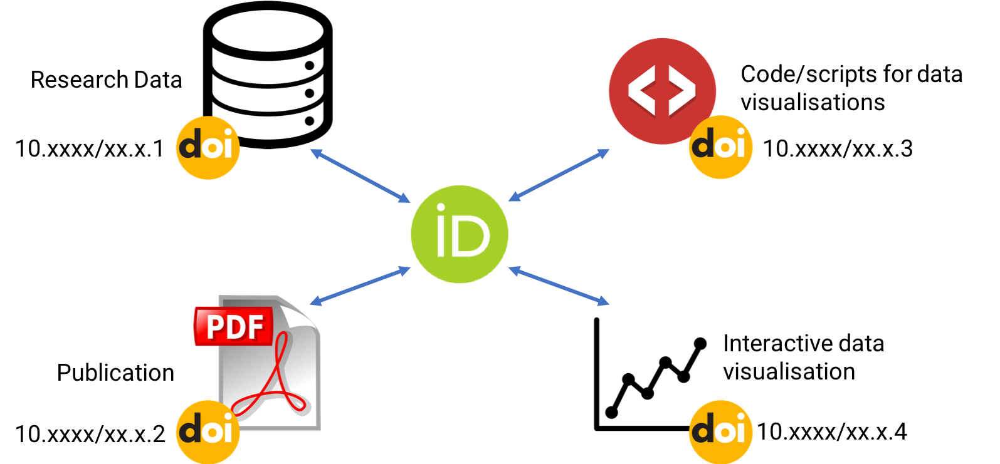
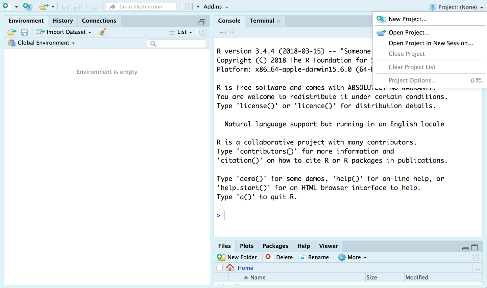
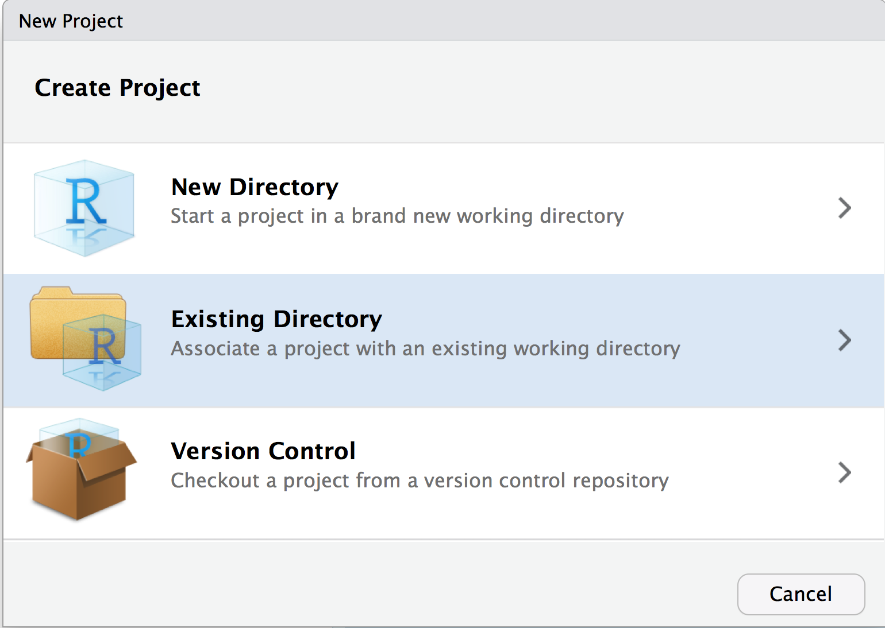
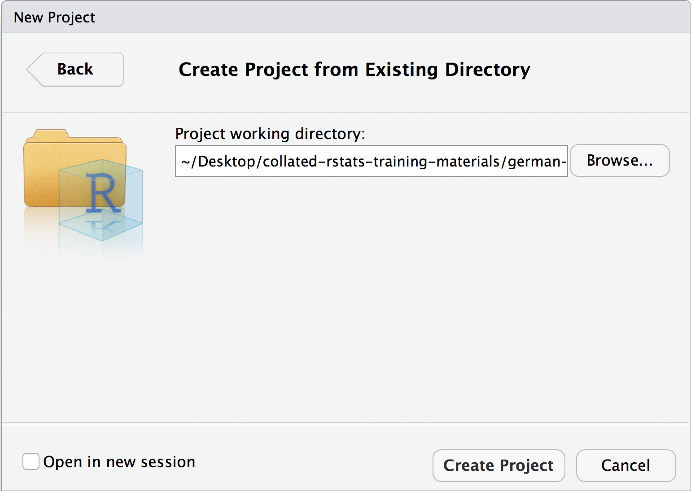
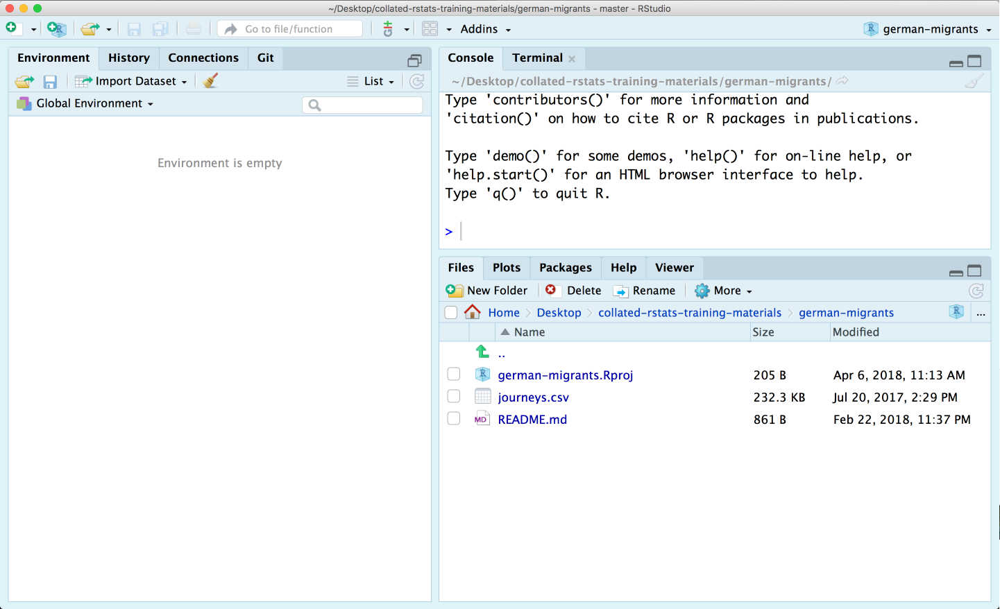

## What is a reproducible data [visualisation] workflow?

Reproducability and replicability are hot topics in both academia and industry. Some of the more high profile examples of this include:

- **Reinhart and Rogoff Controversy**: A student's replicability test of this seminal paper revealed the underlying Excel workbook had an incorrectly written formula, which was published here [DOI: 10.1093/cje/bet075](https://doi.org/10.1093/cje/bet075).

- **Positive findings decrease after methodology pre-reigstration**: Since 2000, researchers have been required to pre-disclose trial methodologies and hypotheses. This has radically decreased the number of "positive" results. [DOI: 10.1371/journal.pone.0132382](https://doi.org/10.1371/journal.pone.0132382)

- **p-value hacking**: There's significant evidence of researchers deliberately selecting or modifying data to achieve a pre-determined p-value. [DOI: 10.1371/journal.pbio.1002106](https://doi.org/10.1371/journal.pbio.1002106).

- **Researchers fear sharing their data**: Large scale studies of researchers across the sciences reveal nearly 50% of respondents would choose not to share the data behind their findings. This is despite the majority of researchers agreeing that the lack of data sharing impedes research. [DOI: 10.1371/journal.pone.0021101](https://doi.org/10.1371/journal.pone.0021101)

One of the issues with reproducability and replicability is that you need to think about it from the very inception of a project, as soon data is collated, generated or discovered.

---

## Reproducible data workflow requirements

- Raw data is retained (securely in the case of sensitive data or datasets where permission for sharing was not given)

- Anonymisation processes are codified (and stored securely)

<br>
<center>

</center>

---

## Reproducible data workflow steps

- Deposit code/processes for cleaning data in an appropriate DOI issuing repository

- Deposit cleaned data in an appropriate DOI issuing repository

- Deposit code for analysis/visualisation in an appropriate DOI issuing repository

- Include your ORCID number alongside all deposits.

<center>

</center>
---

## Reproducible data workflow in industry

Outside of purely academic environments there will be significantly more commercial concerns, and potentially regulatory requirements.

You're recommended to discuss these issues with your colleagues in compliance if you have any queries at all.


---

## Where to deposit code/data

There are literally thousands of DOI-issuing repositories,.

[re3data.org/](https://www.re3data.org/) provides a comprehensive overview of 2000+ repositories.

Fortunately, your choice of repository can usually be simplified by answering the following question:

> Does your data have significantly complicated meta data (genomic, pharmaceutical, astronomical)?


<br>

--

- ✅ Investigate a dedicated repository

--

- ❌ Choose a general purpose repository
--

---

## General purpose data repositories

Two of the most popular general purpose repositories are **Figshare** and **Zenodo**, both provide good API and versionable DOI.

<br>
<center>

<br>
<br>

</center>


---

## What is reproducible code?

In general:

- Reproducible code must contain all steps necessary for another users to run your code, independent of their operating system.

- Reproducible code should include instructions for installing pre-requisite software/tools.

---

## What is reproducible R code?

When it comes to R:

- All code must be contained within script files, not randomly typed into the console.

- All necessary libraries must be loaded at the **top** of a script file

- **Never use `setwd()`**

---

## Never use `setwd()`

Many users of R begin their work with:

```{r, eval=FALSE, include=TRUE}
setwd("/Users/martinjhnhadley/GoogleDrive/courses/interactive-stat-viz")
```

This is a bad way to start.

- You've immediately tied your code to only working on your operating system AND your machine.

Thankfully, RStudio has a great feature called "projects" which handle setting your working directory for you.

---

## RStudio projects

Projects provide a useful mechanic for clearly distinguishing between different work packages/projects. Working with projects provides the following advantages:

- Working directories are set as the project directory

- The project directory can easily be explored through a GUI

- Easily switch between Projects from the Project menu.

---

## Creating RStudio projects

Whenever you start a new project at work, start a new project in RStudio.

1. File -> New Project OR the Projects menu in the top-right of the screen

<center></center>

---

## Wait: What are we going to do?

Through the next few activities and topics we’ll be using a dataset that is loosely based<sup>1</sup> on my work with [Felix Krawatzek](https://www.politics.ox.ac.uk/research-staff/felix-krawatzek.html) that he wrote about here:

https://theconversation.com/writing-home-how-german-immigrants-found-their-place-in-the-us-53342

The actual underlying data is available here: https://doi.org/10.6084/m9.figshare.4516772

We're going to create a new project from the `german-migrants` folder in this repository: https://github.com/martinjhnhadley/collated-rstats-training-materials (short URL: [https://goo.gl/2LwAWh](https://goo.gl/2LwAWh))

.footnote[
[1] I like this dataset! So much so, I resampled it before it was made public so I could use it in other training courses.
]
---

## Creating a project from an existing directory

1. Choose "Existing Directory"

1. Navigate to the `german-migrants` directory

1. Create the project

.pull-left[

]

.pull-right[

]

---

## What's that done?

- A file called `german-migrants.Rproj` has been created (this is the project).

- The working directory has been set to the folder containing the `german-migrants.Rproj` file.

<center>

<center>

---

## Organising our data

Well organised projects (typically) have two data folders:

> /data-raw
>
> This contains your raw, messy, and non-anonymised data. It should also contain scripts for cleaning and tidying your data, the outputs of which should be written into the data folder.

and

> /data
>
> This contains the version of your data you're happy to share.

Following this advice ensures you never accidentally modify your original data, because it's read-only.

Plus, your anonymisation process is now fully self-contained and easily removed before publication.

---

## Setting ourselves up

- Create both a `data` and `data-raw` folder in our project

- Move the `journeys.csv` file into the `data-raw` folder

- Create a new script file in `data-raw` called `clean-journeys.R`

---

## Aside: Naming Things

Naming things (particularly data files) is complicated and usually becomes a mess. 

It's well recommended that from the beginning of your projects you start as you mean to go on.

.pull-left[
<center>

</center>
]

.pull-right[

- Immediately stop using spaces in filenames.

- Insert the date at the beginning of the filename
]

Then read these awesome slides from [@JennyBryan](https://twitter.com/JennyBryan): [https://speakerdeck.com/jennybc/how-to-name-files](https://speakerdeck.com/jennybc/how-to-name-files)

---

## Importing the data using tidyverse

Flat files like our journeys.csv file are imported into R using the `readr` library - part of the core tidyverse.

To import our file we use the following code:

```{r, eval=FALSE}
library("tidyverse")
raw_journeys <- read_csv("data-raw/journeys.csv")
```

<br>
<br>

Now we're setup for reproducibly doing this, let's move on to wrangling the data with the tidyverse.


