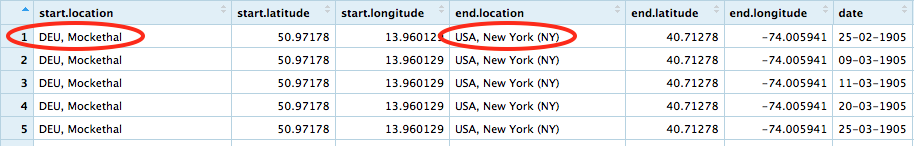

## Identifying inconsistencies in raw data

Identifying inconsistencies in our raw data is made fairly simple by `readr` being very noisy:

```{r, eval=FALSE}
library("tidyverse")
raw_journeys <- read_csv("data-raw/journeys.csv")
```

```{r message=TRUE, warning=TRUE, echo=FALSE}
suppressPackageStartupMessages(library("tidyverse"))
raw_journeys <- read_csv("data-raw/journeys.csv")
```

---

## Understanding read_csv messages

The `read_csv` messages tell us how each column is parsed, there's one issue that should jump out at you:


```{r, eval=FALSE}
library("tidyverse")
raw_journeys <- read_csv("data-raw/journeys.csv")
```

```{r message=TRUE, warning=TRUE, echo=FALSE}
suppressPackageStartupMessages(library("tidyverse"))
raw_journeys <- read_csv("data-raw/journeys.csv")
```


--
> The `date` column has been parsed as character rather than dates.
--

---

## Using the `View()` function

`View()` allows us to view our imported data inside of RStudio, it's often convenient to name your view tabs:

```{r, eval = FALSE}
View(raw_journeys, title = "raw journeys")
```

Can you see any problems in the data?

---

## start.location and end.location columns

The location columns contain multiple pieces of data! 

These columns should be split into **at least** country and city.



---

## Planning our wrangling

Let's wrangle ourselves out of these problems in the following order:

1. Split location columns into country and city

1. Convert the character dates into dates that can be used for calculations in R

---

## Splitting locations into country and city

The `dplyr` library of the tidyverse contains a host of **verbs** for wrangling data - we say **verb** when really we mean **a function from the tidyverse that does X** 

There's a specific verb for our task, **separate**.

---

## separate documentation

If we consult the documentation for an explanation of the function, we're introduced to this beast `%>%`

```{r, eval=FALSE}
library(dplyr)
df <- data.frame(x = c(NA, "a.b", "a.d", "b.c"))
df %>% separate(x, c("A", "B"))
```

The code we will use to split the `start.location` column also uses `%>%`

```{r, eval=FALSE}
raw_journeys %>%
  separate(start.location, into = c("start.country", "start.city"))
```

Let's ensure we're all sure what `%>%` is for...


---

## What is %>%?

The `%>%` [pipe operator] is an intrinsic part of the tidyverse and pretty much every single htmlwidget library is designed with them in mind.

For an example of why we want to use pipes, I'll borrow the [following example](https://twitter.com/AmeliaMN/status/748193609401327616) from Hadley Wickham:

--

*How can we convert this poem into code?*

> Little bunny Foo Foo

> Went hopping through the forest

> Scooping up the field mice

> And bopping them on the head

---

## Coding up little bunny foo foo

> Little bunny Foo Foo </br>
> Went hopping through the forest </br>
> Scooping up the field mice </br>
> And bopping them on the head </br>

Let's instantiate a bunny called `foo_foo`

```{r, eval=FALSE}
foo_foo <- little_bunny()
```

Now let's write the poem out as code:

```{r, eval=FALSE}
bop_on(
  scoop_up(
    hop_through(foo_foo, forest),
    field_mouse
  ),
  head
)
```

---

## Understanding our code

In order to understand what our code does, we need to parse it:

- Find the deepest expression (the first thing that happens)

- Work backwards (or up) the code

```{r, eval=FALSE}
bop_on(
  scoop_up(
    hop_through(foo_foo, forest),
    field_mouse
  ),
  head
)
```

This is exactly counter to the order of operations in the original poem

---

## Piping little bunny foo foo

Let's instantiate a bunny called `foo_foo`

```{r, eval=FALSE}
foo_foo <- little_bunny()
```

Now write the same code as before but using pipes:

```{r, eval=FALSE}
foo_foo %>%
  hop_through(forest) %>%
  scoop_up(field_mouse) %>%
  bop_on(head)
```

The order we read operations is exactly the same as the order in which the operations happen!

---

## Comparing the two

Independent of pipes, we create ourselves a little bunny:

```{r, eval=FALSE}
foo_foo <- little_bunny()
```

Now comparing the two code samples, the one with pipes is easier to parse by eye.

.pull-left[
```{r, eval=FALSE}
bop_on(
  scoop_up(
    hop_through(foo_foo, forest),
    field_mouse
  ),
  head
)
```
]

.pull-right[
```{r, eval=FALSE}
foo_foo %>%
  hop_through(forest) %>%
  scoop_up(field_mouse) %>%
  bop_on(head)
```
]

Admitedly, this doesn't explain what `%>%` actually does!

---

## Simpler %>% example

The pipe operator takes the left-hand side of your expression and inserts it into the first argument of the right-hand side of the expression:

```{r, eval = FALSE}
"cats" %>% rep(4)
```

--

There's nothing special about `rep`, it's `%>%` which is doing the work.

`%>%` is an example of what's called **syntactic sugar** it makes code easier to write/read.

--

---

## Pushing the pipe further

In some cases you don't want the left-hand side in the first argument, you can explicitly shove it somewhere else by using a period `.`

```{r, eval = FALSE}
"cats" %>% paste(., "are great", "but one can have too many", .)
```

---

## Where does `%>%` come from?

`magrittr` is the package that gives us `%>%`, it was first introduced in 2014 and since then has become ridiculously popular.

The pipe is now an intrinsic part of the `tidyverse` and made available to us when we load it.

---

## Advice on using `%>%`

The pipe isn't a hammer to be used without exception, some code is both harder to write and read with pipes.

Pipe chains longer than ~10 operations are unwiedly, you're recommended to make intermediatry assignments to break up the chain.

---

## What if I hate `%>%`?

It's perfectly acceptable to hate `%>%`. 

That's fine. 

It's just sugar to sweeten the already lovely R.

<br>
<br>

However, you need a basic understanding of it to read most documentation pages in the `tidyverse` (and beyond).
---

## Back to separating columns

Our pipe chain from before inserted our tibble into the separate verb, but why the error messages?

```{r,include=FALSE, message=FALSE, warning=FALSE, include=FALSE}
library("tidyverse")
raw_journeys <- read_csv("data-raw/journeys.csv")
```


```{r}
foobar <- raw_journeys %>%
  separate(start.location, into = c("start.country", "start.city"))
```

Let's extract some of these rows from the original data to make sense of the error messages.

---

## Slicing our data

The `slice` verb allows us to extract rows (you're highly recommended to use this instead of indexing with `[]`)

```{r}
raw_journeys %>%
  slice(16:20)
```

---

## Selecting columns

The `select` verb allows us to extract specific columns.

As with most tidyverse functions, this uses **non-standard evaluation** to allow us to give "naked column names"<sup>1</sup>

```{r}
raw_journeys %>%
  slice(16:20) %>%
  select(start.location)
```

.footnote[
[1] They're naked because there are no "" surrounding the column names
]

---

## Accepting when to move on

We could write code to fully extract all the data from the columns, but let's move on for now.

Copying and pasting is never cheating in code, make sure you have the following code on your machine:

```{r}
journeys <- raw_journeys %>%
  separate(start.location, 
           into = c("start.country", 
                    "start.city"), extra = "drop") %>%
  separate(end.location, 
           into = c("end.country", 
                    "end.city"), extra = "drop")
```

---

## Lubridate for manipulating dates

`lubridate` is a member of the tidyverse but not loaded by default, it contains a host of functions for manipulating and working with dates.

```{r}
library("lubridate")
character_dates <- c("10/10/2018", "01/1/2017")
date_dates <- dmy(character_dates)
```

Let's prove to ourselves these are nice date-like objects:

```{r}
date_dates[1] - date_dates[2]
```

---

## Modifying columns with mutate

`mutate` allows us to modify or add columns to tibbles:

```{r}
journeys %>%
  mutate(date = dmy(date)) %>%
  select(date, everything()) 
```

---

## Exporting tidied data

We've fixed our two problems with the following wrangling code:

```{r}
journeys <- raw_journeys %>%
  separate(start.location, 
           into = c("start.country", 
                    "start.city"), extra = "drop") %>%
  separate(end.location, 
           into = c("end.country", 
                    "end.city"), extra = "drop") %>%
  mutate(date = dmy(date))
```

Now we can export the tidied data with `read_csv`:

```{r}
journeys %>%
  write_csv("data/journeys.csv")
```

---

## Full circle: importing the clean data

Create a new script file called "exploratory-data-analysis.R".

What code needs to be written to do the following in this file<sup>1</sup>?

1. Load the tidyverse.

1. Import the tidied data.

.footnote[
[1] Answer on next page
]

---

## Full circle: importing the clean data


```{r}
library("tidyverse")
journeys <- read_csv("data/journeys.csv")
```

---

## The tidyverse of verbs

The tidyverse has a vast array of very powerful verbs, we're using a tiny subset of them here.

These are excellent resources for an introduction to the tidyverse family of verbs:

- [r4ds.had.co.nz](r4ds.had.co.nz): Online version of R for Data Science by Garrett Grolemund & Hadley Wickham
- [RStudio Cheats Sheets](https://www.rstudio.com/resources/cheatsheets/): Excellent, printable (!) resources which are also baked into RStudio (Help -> Cheatsheets)


