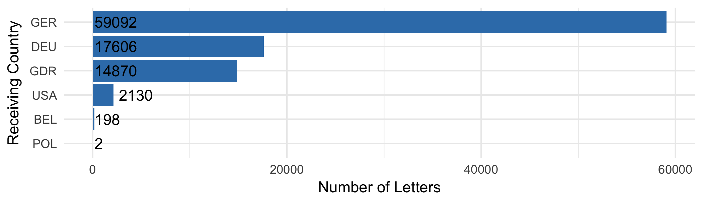
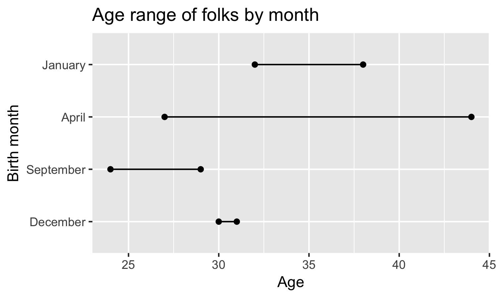
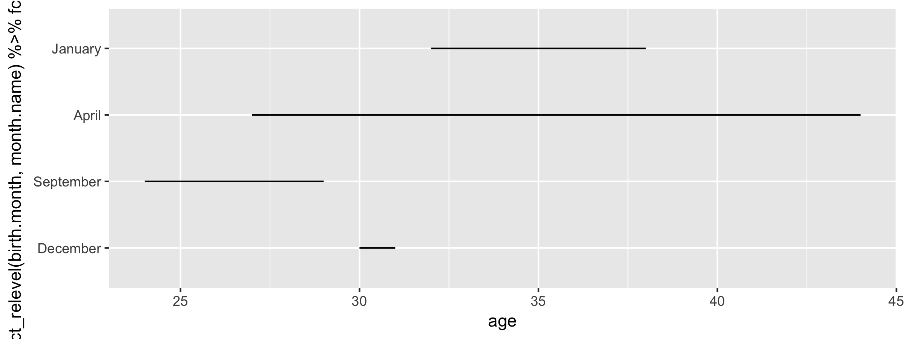

```{r setup, echo=FALSE}
knitr::opts_chunk$set(fig.align = "center")
```


## Exploratory Data Analysis and ggplot2

The interactive charts that we're going to build later today are primarily useful for communicating your understand and analysis of your datasets.

Before getting to that point, we need to understand the basics of how to do some exploratory data analysis with the tidyverse.

<br>
<br>

> Exploratory data analysis is about generating an understanding of your data, to suggest potential hypotheses and gain insight on what statistical tools might be appropriate for handling the data

---

## Understanding our data

Before progressing with visualising datasets, it's important we understand exactly what our data is.

`data.frame`s are the general purpose rectangular data structure in R, most folks are familiar with it. 

The `tidyverse`, uses a slightly different thing:

```{r message=FALSE, warning=FALSE}
library("tidyverse")
journeys <- read_csv("data/journeys.csv")
```


.pull-left[
```{r}
class(iris)
```
]

.pull-right[
```{r}
class(journeys)
```
]

---

## tibbles vs data.frames

We can *almost* interchangeably refer to `tibbles` and `data.frames`, the primary difference we see is how they appear in the console.

### Print methods...

Technically, this means that `tibble` has a different "print method" to `data.frame`.

`tibble`'s print method is very smart! It includes information about the size and type of data inside your object.

---

```{r}
iris %>%
  head()
```

```{r}
journeys %>%
  head()
```

---

## Grouping data thanks to tibbles

Tibbles also support `groups`, which allows for hierarchical groupings of data.

There are two categories of things we can do with groups:

- Insert/tally groups: with either `group_by` or `count`, respectively

- Insert/modify columns: with `mutate` or `summarise`

---

## Differences between count and group_by

.pull-left[
```{r, eval = FALSE}
journeys %>%
  count(start.country, 
        end.country)
```

- Counts number of observations in each group

- Removes all columns not specified to `count`

- Removes groups

]

.pull-right[
```{r, eval = FALSE}
journeys %>%
  group_by(start.country, 
           end.country)
```

- Inserts groups

- Groups can be used for later calculations

]

---

## Tibbles are greedy for groups

You **must** remove groups manually with `ungroup` otherwise they'll stay around forever:

```{r, eval = FALSE}
journeys %>%
  group_by(start.country, end.country) %>%
  ungroup()
```

---

### summarise
`summarise` drops all columns that are not included in `groups`:

```{r, eval = FALSE}
journeys %>%
  group_by(start.country, end.country) %>%
  summarise(median.letters = median(number.of.letters))
```


--
### mutate
`mutate` inserts a new column on the far-right of the `tibble`:

```{r, eval = FALSE}
journeys %>%
  group_by(start.country, end.country) %>%
  mutate(median.letters = median(number.of.letters)) %>%
  select(median.letters, everything())
```

... It's often convenient to use `select(median.letters, everything())` to move the new column to the far-left of the `tibble`.

---

```{r, eval = TRUE}
journeys %>%
  group_by(start.country, end.country) %>%
  summarise(total.letters = sum(number.of.letters)) %>%
  glimpse()
```

```{r, eval = TRUE}
journeys %>%
  group_by(start.country, end.country) %>%
  mutate(total.letters = sum(number.of.letters)) %>%
  glimpse()
```

---

## Static charts with ggplot2

`ggplot2` is tremendously powerful and flexible for creating static charts for exploratory data analysis, also for print!

```{r echo=FALSE, out.width="80%"}
gg_receiving_countries <- journeys %>%
  group_by(end.country) %>%
  summarise(total.letters = sum(number.of.letters)) %>%
  ggplot(aes(x = fct_reorder(end.country, total.letters),
             y = total.letters)) +
  geom_col(fill = "#377eb8") +
  geom_text(
    aes(
      label = total.letters, 
      y = ifelse(total.letters > 1000 & total.letters < 6000, 
             2700,
             200)
      ),
    position = position_dodge(0.5),
    vjust = 0.5,
    hjust = 0
  ) +
  xlab("Receiving Country") +
  ylab("Number of Letters") +
  coord_flip() +
  theme_minimal()
ggsave("ggsaves/german-migrants_receiving-countries.png",
         plot = gg_receiving_countries,
         width = 7,
         height = 2)

```

There are two really important things we need to remember when using it:

- It uses **non-standard evaluation** to allow naked column names to be used in code

- It pre-dates `%>%` and instead uses `+` for adding layers to a `ggplot` object

---

## ggplot(aes())

The `aes` function specifies the mappings between variables in your data and the visual components of the chart:

```{r, eval=FALSE}
journeys %>%
  group_by(end.country) %>%
  summarise(total.letters = sum(number.of.letters)) %>%
  ggplot(aes(x = end.country,
             y = total.letters))
```

---

```{r, echo=FALSE}
journeys %>%
  group_by(end.country) %>%
  summarise(total.letters = sum(number.of.letters)) %>%
  ggplot(aes(x = end.country,
             y = total.letters))
```

---

## geom_col()

geoms are objects that populate our charts, dependent on the aesthetic mappings between the data and the chart's internal "coordinate system"

```{r, eval=FALSE}
journeys %>%
  group_by(end.country) %>%
  summarise(total.letters = sum(number.of.letters)) %>%
  ggplot(aes(x = end.country,
             y = total.letters)) + 
  geom_col()
```

---

```{r, echo = FALSE}
journeys %>%
  group_by(end.country) %>%
  summarise(total.letters = sum(number.of.letters)) %>%
  ggplot(aes(x = end.country,
             y = total.letters)) + 
  geom_col()
```

---

## Ordering variables in charts

In `ggplot2`, and the interactive charts we'll be creating later today, it's crucial that we understand how to order variables in a chart.

This is often (*but not always*) achieved through the use of `factors`:

- factors are categorical variables (there are a limited set of values allowed in the data structure)

- ordered factors have an internal ordering (**levels**) that affects how other functions treat them

- ordered factors are printed in the order observations appear, not in the order specified by the **levels**

---

## Birthday factors example

In the [martinjhnhadley/collated-rstats-training-materials](https://goo.gl/2LwAWh) repo [[https://goo.gl/2LwAWh](https://goo.gl/2LwAWh)] there's an RStudio project that helps us introduce factors and the `forcats` library.

1. Open the `birthday-factors.RProj` project

1. Open the `birthday-factors.R` file

1. Run these lines:

```{r, eval=FALSE}
library("tidyverse")

birthdays <- read_csv("data/birthdays.csv")
```

---

## Birthday factors example

.pull-left[

```{r, eval = FALSE}
birthdays
```

```{r eval=TRUE, echo=FALSE, message=FALSE, warning=FALSE}
birthdays <- tribble(
  ~name, ~birth.month, ~age,
  "Riley", "December", 30,
  "Taylor", "September", 29,
  "Jo", "September", 24,
  "Elliott", "December", 31,
  "Charlie", "January", 38,
  "Sean", "January", 32,
  "Sam", "April", 27,
  "Alex", "April", 44
)
birthdays
```
]

.pull-right[

The dataset has the birth month and age of a number of different people, we're interested in creating the following chart.

```{r echo=FALSE, message=FALSE, warning=FALSE, paged.print=FALSE}
gg_birthday_factors <- birthdays %>%
  ggplot(aes(
    x = fct_relevel(
      birth.month,
      month.name
    ) %>%
      fct_rev(),
    y = age
  )) +
  geom_line() +
  geom_point() +
  xlab("Birth month") +
  ylab("Age") +
  ggtitle("Age range of folks by month") +
  coord_flip()
ggsave("ggsaves/gg_birthday_factors.png",
       gg_birthday_factors,
       width = 5,
       height = 3)

```

]

---

# ggplot2 without factors

Let's follow the steps from building our previous `ggplot2` to build the visualisation we just saw:

1. Use `aes` to map our columns to aesthetics of the chart

1. Choose an appropriate `geom_*` for the chart

1. Flip the coordinates of the chart

--

```{r, eval = FALSE}
birthdays %>%
  ggplot(aes(
    x = ,
    y = 
  )) +
  geom_line() +
  coord_flip()
```

---

# What's wrong with the chart?

```{r, echo = FALSE}
gg_nofactor_birthdays <- birthdays %>%
  ggplot(aes(
    x = birth.month,
    y = age
  )) +
  geom_line() +
  coord_flip()
ggsave("ggsaves/gg_nofactor_birthdays.png",
       gg_nofactor_birthdays,
       width = 5,
       height = 3)

```

---

# forcats

`forcats` is part of the tidyverse and radically simplifies the process of working with factors.

`fct_relevel` allows us to specify a canonical order for elements within a factor:

```{r}
fct_relevel(c("September",
            "January",
            "December",
            "April"),
          levels = month.name)
```

---

# aes(x = fct_relevel(...))

```{r echo=TRUE, message=FALSE, warning=FALSE, eval = FALSE}
birthdays %>%
  ggplot(aes(
    x = fct_relevel(birth.month, 
                    month.name),
    y = age
  )) +
  geom_line() +
  coord_flip()
```


```{r echo=FALSE, message=FALSE, warning=FALSE}
gg_nofactor_birthdays <- birthdays %>%
  ggplot(aes(
    x = fct_relevel(birth.month, 
                    month.name),
    y = age
  )) +
  geom_line() +
  coord_flip()
ggsave("ggsaves/gg_nofactor_birthdays.png",
       gg_nofactor_birthdays,
       width = 8,
       height = 3)

```

---

# aes(x = fct_relevel(...) %>% fct_rev())

```{r echo=TRUE, message=FALSE, warning=FALSE, eval = FALSE}
birthdays %>%
  ggplot(aes(
    x = fct_relevel(birth.month, 
                    month.name) %>%
      fct_rev(),
    y = age
  )) +
  geom_line() +
  coord_flip()
```


```{r echo=FALSE, message=FALSE, warning=FALSE}
gg_nofactor_birthdays <- birthdays %>%
  ggplot(aes(
    x = fct_relevel(birth.month, 
                    month.name) %>%
      fct_rev(),
    y = age
  )) +
  geom_line() +
  coord_flip()
ggsave("ggsaves/gg_nofactor_birthdays.png",
       gg_nofactor_birthdays,
       width = 8,
       height = 3)

```

---

# Summary

The `tidyverse` provides a wide range of different tools for importing, wrangling and exploring datasets.

The `ggplot2` library is very powerful for creating quick static charts.

When scripting charts it's often necessary to think carefully about how a package chooses to order categorical aesthetics.