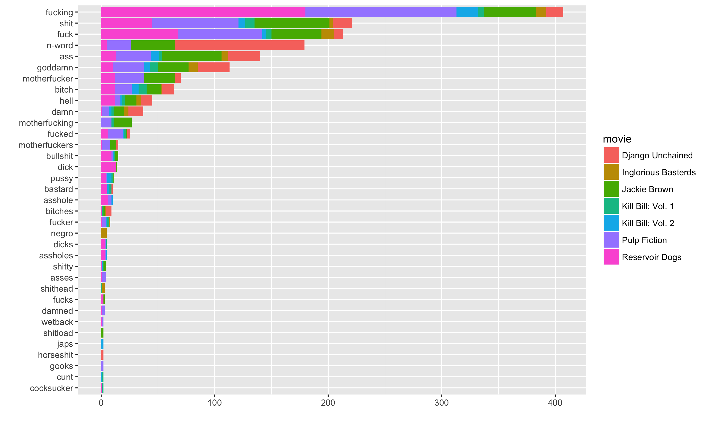

# Interactive charts with htmlwidgets

We're going to introduce two libraries for creating interactive charts:

- plotly: an extremely popular library that has the special power of converting (simple) ggplot2 into interactive plotly charts.

- highcharter: a binding to the highcharts library which specialises in creating sleek, beautiful charts. Note that there is a charge for using this library in commercial applications.

Before introducing these two libraries, let's decide on what charts we want to create.

---

# Tarantino Films

Fivethirtyeight.com make available a number of interesting datasets in their `fivethirtyeight` package.

This includes the data behind "[A Complete Catalog Of Every Time Someone Cursed Or Bled Out In A Quentin Tarantino Movie](https://fivethirtyeight.com/features/complete-catalog-curses-deaths-quentin-tarantino-films/)"

```{r}
library("fivethirtyeight")
tarantino %>%
  head()
```

---

# Grouped bar chart

Let's create this chart in both `plotly` and `highcharter` (after building it in `ggplot2` first):

```{r, echo=FALSE}
library("tidyverse")
library("fivethirtyeight")
gg_tarantino <- tarantino %>%
  filter(complete.cases(.)) %>%
  count(word, movie) %>%
  group_by(word) %>%
  mutate(total.n = sum(n)) %>%
  filter(total.n > 1) %>%
  ggplot(aes(x = fct_reorder(word, total.n),
             y = n,
             fill = movie)) +
  geom_col() +
  xlab("") +
  ylab("") +
  coord_flip()
ggsave("ggsaves/gg_tarantino.png",
       width = 10,
       height = 6)

```

---

# Tallying data

What function do we use to calculate hierarchical tallies in our data?

--

```{r}
tarantino %>%
  count(word, movie)
```

---

# Calculate total instance of each word

We need to now calculate the total incidence of each word, which two functions do we need?

```{r, eval = FALSE}
tarantino %>%
  count(word, movie)
```

--

- group_by
- mutate **not** summarise as we don't want to throw away columns


```{r}
tarantino %>%
  count(word, movie) %>%
  group_by(word) %>%
  mutate(total.n = sum(n))
```

---

# ggplot2

Fill in the missing arguments here:

```{r, eval = FALSE}
tarantino %>%
  filter(complete.cases(.)) %>%
  count(word, movie) %>%
  group_by(word) %>%
  mutate(total.n = sum(n)) %>%
  filter(total.n > 1) %>%
  ggplot(aes(x = ,
             y = ,
             fill = ))
```

---

# Tidying the ggplot

Here's our final beautified code:

```{r, eval = FALSE}
tarantino %>%
  filter(complete.cases(.)) %>%
  count(word, movie) %>%
  group_by(word) %>%
  mutate(total.n = sum(n)) %>%
  filter(total.n > 1) %>%
  ggplot(aes(x = fct_reorder(word, total.n),
             y = n,
             fill = movie)) +
  geom_col() +
  coord_flip()
```

---

# Standardised dataset

Here's the dataset we're going to visualise with both `plotly` and `highcharter`

```{r}
tarantino_swears <- tarantino %>%
  filter(complete.cases(.)) %>%
  count(word, movie) %>%
  group_by(word) %>%
  mutate(total.n = sum(n)) %>%
  filter(total.n > 1) 
```

