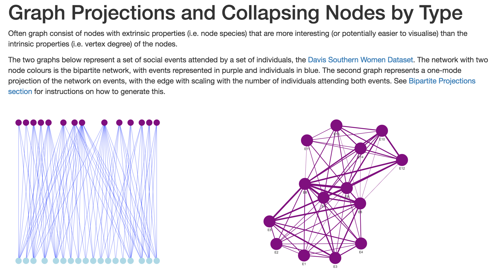

```{r, include=FALSE}
knitr::opts_chunk$set(fig.width=10, fig.height=6, fig.path='Figs/',
                      echo=FALSE, warning=FALSE, message=FALSE)
```

# Course Materials and Structure

This course is entirely self-contained, the lecturer notes and exercises have been writtedn using RMarkdown. 

You will primarily be working in the RSS_handouts folder, by the end of the day you'll have enough experience with R and RMarkdown that you'll be able to run the lecturer notes on your own machine.

The course will follow this general structure:

```{r}
# timetable <- list(
#   "10:00 - 11:00" = "Getting started with R and the tidyverse",
#   "11:00 - 11:30" = "Coffee",
#   "11:30 - 12:30" = "Interative visualisations with htmlwidgets",
#   "12:30 - 14:00" = "Lunch",
#   "14:00 - 15:00" = "Interactive reports with RMarkdown",
#   "15:00 - 15:30" = "Coffee",
#   "15:30 - 17:00" = "Interactive dashboards with Shiny"
#   )
#   library("tidyverse")
#   timetable <- tibble(times = names(timetable),
#   topic = as.character(timetable))
#   knitr::kable(timetable)

timetable <- list(
  
  "09:30 - 11:00" = "Up and Running",
  "11:20 - 12:30" = "htmlwidgets",
  "13:30 - 15:00" = "RMarkdown",
  "15:20 - 16:30" = "Shiny"
  # 
  # 
  # "10:00 - 11:00" = "Getting started with R and the tidyverse",
  # "11:00 - 11:30" = "Coffee",
  # "11:30 - 12:30" = "Interative visualisations with htmlwidgets",
  # "12:30 - 14:00" = "Lunch",
  # "14:00 - 15:00" = "Interactive reports with RMarkdown",
  # "15:00 - 15:30" = "Coffee",
  # "15:30 - 17:00" = "Interactive dashboards with Shiny"
)
library("tidyverse")
timetable <- tibble(
  times = names(timetable),
  topic = as.character(timetable)
)
knitr::kable(timetable)
```

# Questions

Before continuing with the course, I'd like to understand everyone's experience with R thus far:

- Who has never used R before?
- Who has used RStudio?
- Who has used Projects in RStudio?
- Who has used ggplot2?
- Who is familiar with what this is called %>% and why it's used?
- Who has heard of the tidyverse?
- Who has heard of htmlwidgets? Who has used them?
- Who has used Shiny?

# Course Overview

This course is designed to introduce you to the basics of creating interactive data visualisations using R; with two very different technologies:

- RMarkdown
- Shiny

No prior knowledge of R is expected, the necessary "programming patterns" and workflows will be introduced through the course.

Please note that this course will **NOT** provide a sufficient overview of the R language to start analysing data and doing useful stuff.

>* This course shows you how to make Shiny stuff.

# Scope of Course

This course covers the following topics:

>- Importing and wrangling data with the tidyverse

>- Tools for building an understanding of your data

>- Building interactive maps, networks and charts using htmlwidgets

# Maps with leaflet

```{r, echo=TRUE}
library("leaflet")
library("tidyverse")
locations <- read_csv("data/university-locations.csv")
leaflet(locations,
        options = leafletOptions(zoomControl = FALSE)) %>%
  addTiles() %>%
  addCircleMarkers(label = ~University)
```

# Networks with visNetwork

```{r, echo=TRUE}
library("visNetwork")

## Data from https://www.kaggle.com/mylesoneill/game-of-thrones and manipulated by hand by https://shiring.github.io/

got_nodes <- read_csv("data/GoT_nodes.csv")
got_edges <- read_csv("data/GoT_edges.csv")

got_nodes <- got_nodes %>%
  mutate(group = superculture)

visNetwork(got_nodes,
           got_edges) %>%
  visIgraphLayout() %>%
  visLegend(ncol = 2)
```

# Charts with plotly and highcharter

Plotly

```{r}
library("oidnChaRts")
library("plotly")
data_stacked_bar_chart %>%
  filter(timestamp == max(timestamp)) %>%
  group_by(country_group, occupation) %>%
  summarise(total.jobs = sum(count)) %>%
  plot_ly() %>%
  add_trace(
    x = ~total.jobs,
    y = ~country_group,
    color = ~occupation
  ) %>%
  layout(margin = list(l = 150),
         yaxis = list(title = ""))
```

Highcharter

```{r, echo=TRUE}
library("highcharter")

data_stacked_bar_chart %>%
  filter(timestamp == max(timestamp)) %>%
  group_by(country_group, occupation) %>%
  summarise(total.jobs = sum(count)) %>%
  ungroup() %>%
  group_by(country_group) %>%
  mutate(country_total = sum(total.jobs)) %>%
  arrange(desc(country_total)) %>%
  hchart(
    type = "bar",
  hcaes(
    y = total.jobs,
    x = country_group,
    group = occupation
  ))

```

# Scope of Course

This course covers the following topics:

- Importing and wrangling data with the tidyverse

- Tools for building an understanding of your data

- Building interactive maps, networks and charts using htmlwidgets

- Writing documents/presentations using RMarkdown; including text, code and interactive output in the same document

# RPubs

[RPubs.com](rpubs.com) is a free and open platform for publishing and sharing HTML RMarkdown documents with others.

RPubs and Shiny are both maintained by the team behind RStudio and are fully integrated into the IDE.

Note that while documents hosted on RPubs are made public, the underlying code/.rmd files cannot be downloaded by others.

<a href="https://rpubs.com/martinjhnhadley/graph_projections_and_collapsing_nodes"></a>

# Scope of Course

This course covers the following topics:


- Importing and wrangling data with the tidyverse

- Tools for building an understanding of your data

- Building interactive maps, networks and charts using htmlwidgets

- Writing documents/presentations using RMarkdown; including text, code and interactive output in the same document

- Build interactive web applications using Shiny for exploring datasets using htmlwidget visualisations, without any* knowledge of HTML or JavaScript

*for complicated things, you might need a little bit of CSS/HTML/JavaScript

# Basic Shiny Example

This is an example of a shiny app from the [shiny.rstudio.com](http://shiny.rstudio.com/gallery/tabsets.html) website:

```{r}
## Example copied from http://shiny.rstudio.com/gallery/tabsets.html
## All rights reserved
shinyApp(
  ui = fluidPage(
    
  # Application title
  titlePanel("Tabsets"),
  
  # Sidebar with controls to select the random distribution type
  # and number of observations to generate. Note the use of the
  # br() element to introduce extra vertical spacing
  sidebarLayout(
    sidebarPanel(
      radioButtons("dist", "Distribution type:",
                   c("Normal" = "norm",
                     "Uniform" = "unif",
                     "Log-normal" = "lnorm",
                     "Exponential" = "exp")),
      br(),
      
      sliderInput("n", 
                  "Number of observations:", 
                   value = 500,
                   min = 1, 
                   max = 1000)
    ),
    
    # Show a tabset that includes a plot, summary, and table view
    # of the generated distribution
    mainPanel(
      tabsetPanel(type = "tabs", 
        tabPanel("Plot", plotOutput("plot")), 
        tabPanel("Summary", verbatimTextOutput("summary")), 
        tabPanel("Table", tableOutput("table"))
      )
    )
  )
),
server = function(input, output) {
  
  # Reactive expression to generate the requested distribution.
  # This is called whenever the inputs change. The output
  # functions defined below then all use the value computed from
  # this expression
  data <- reactive({
    dist <- switch(input$dist,
                   norm = rnorm,
                   unif = runif,
                   lnorm = rlnorm,
                   exp = rexp,
                   rnorm)
    
    dist(input$n)
  })
  
  # Generate a plot of the data. Also uses the inputs to build
  # the plot label. Note that the dependencies on both the inputs
  # and the data reactive expression are both tracked, and
  # all expressions are called in the sequence implied by the
  # dependency graph
  output$plot <- renderPlot({
    dist <- input$dist
    n <- input$n
    
    hist(data(), 
         main=paste('r', dist, '(', n, ')', sep=''))
  })
  
  # Generate a summary of the data
  output$summary <- renderPrint({
    summary(data())
  })
  
  # Generate an HTML table view of the data
  output$table <- renderTable({
    data.frame(x=data())
  })
  
},
options = list(height = 500, width = "100%")
)
```

# Shiny apps with interactive maps

```{r}
library(shiny)
library(leaflet)
library(tidyverse) # tidyverse imports data processing/importing tools, see https://github.com/hadley/tidyverse

locations <- read_csv("data/university-locations.csv")

## Assign (meaningless) categories
locations$type <- rep(c("A","B","C"), each = 5, len = 15)
palette <- colorFactor(c("#1b9e77","#d95f02","#7570b3"), locations$type)

ui <- navbarPage(
    "Interactive Map",
    tabPanel("Map of Universities",
             wellPanel("The map below is generated with leaflet, the shiny-dependent interactivity comes from the pulldown menu."),
             fluidPage(
               ## url_allow_popout_UI MUST occur in first tabPanel
               uiOutput("url_allow_popout_UI"),
               uiOutput("selected_categories_UI"),
               leafletOutput("leaflet_map")
             )),
    tabPanel("About",
             fluidPage(
               HTML(paste0("This is a standard template app, for a thoroughly documented version of this app see ","<a href='https://ox-it.github.io/OxfordIDN_Shiny-App-Templates/Layouts/navbarPage/'>here</a>"))
             )),
    collapsible = T
  )

server <- function(input, output, session) {

  ## ==== About Page
  output$about_page_UI <- renderUI({
    includeHTML(knitr::knit("About_Page.Rmd"))
  })
  
  ## ==== Viz Page
  output$selected_categories_UI <- renderUI(
    selectInput(
      "selected_categories",
      "Selected Categories",
      choices = locations$type,
      selected = locations$type,
      multiple = T,
      width = "100%"
    )
  )
  
  leaflet_map_data <- eventReactive(
    input$selected_categories,
    locations %>%
      filter(type %in% input$selected_categories),
    ignoreNULL = TRUE
  )
  
  output$leaflet_map <- renderLeaflet({
    leaflet(leaflet_map_data(),
            options = leafletOptions(zoomControl = FALSE)) %>%
      addTiles() %>%
      addCircleMarkers(color = ~ palette(type),
                       label = ~University)
  })
  
}
shinyApp(ui, server, options = list(height = "1000px"))
```


# Scope of Course

This course covers the following topics:

- Building interactive maps, networks and charts using htmlwidgets

- Writing documents/presentations using RMarkdown; including text, code and interactive output in the same document

- Build interactive web applications using Shiny for exploring datasets using htmlwidget visualisations, without any* knowledge of HTML or JavaScript
