# Reactivity

Building interactive elements with Shiny is incredibly simple, the difficulty arises in controlling that interactivity - when and how things update.

In the Shiny framework interactivity is achieved through `reactive` expressions which essentially invalidate one another, by moving a slider you are updating a variable which invalidates the dependent output resulting in re-evaluation.

# When does renderPlot update?

The simplest demonstration of reactive expressions is provided by this example:

```{r}
shinyApp(
  ui = 
  fluidPage(
    sidebarLayout(
      sidebarPanel(
        sliderInput("mean", 
                label = "mean", 
                min = 1, 
                max = 10, 
                value = 5, 
                step = 2),
    textInput("plot_label", 
              label = "plot label", 
              value = "my plot")),
    mainPanel(plotOutput("hist")))
  ),
server = function(input, output){
    
    output$hist <- renderPlot({
      hist(rnorm(50, 
                 mean = input$mean, 
                 sd = input$mean / 2), 
           main = input$plot_label)
    })
    
  }
)
```

# When does renderPlot update?

<center>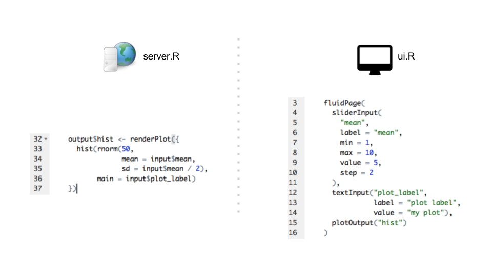</center>

# When does renderPlot update?

<center>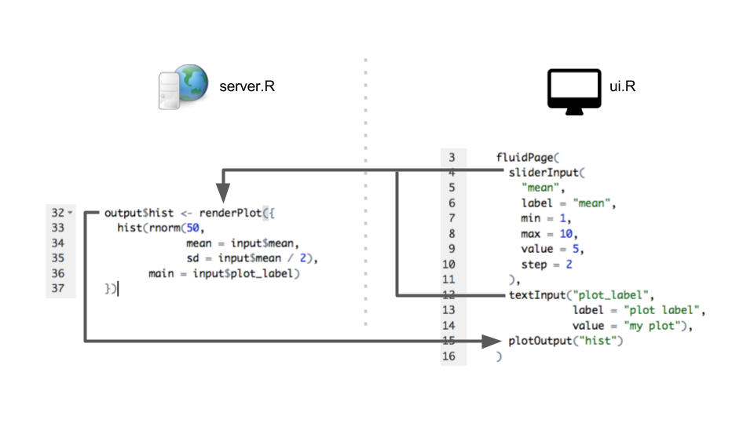</center>

# eventReactive

By splitting the reactivity of the shiny app into distinct operations, the output is guaranteed not to update due to unexpected side effects:

```{r}
shinyApp(
  ui = 
  fluidPage(
    sidebarLayout(
      sidebarPanel(
        sliderInput("mean", 
                label = "mean", 
                min = 1, 
                max = 10, 
                value = 5, 
                step = 2),
    textInput("plot_label", 
              label = "plot label", 
              value = "my plot")),
    mainPanel(plotOutput("hist")))
  )
  ,
  
  server = function(input, output){
    
    hist_data <- eventReactive(input$mean,
                               {
                                 rnorm(50, 
                 mean = input$mean, 
                 sd = input$mean / 2)
                               })
    
    output$hist <- renderPlot({
      hist(hist_data(), 
           main = input$plot_label)
    })
    
  }
)
```

# eventReactive

<center>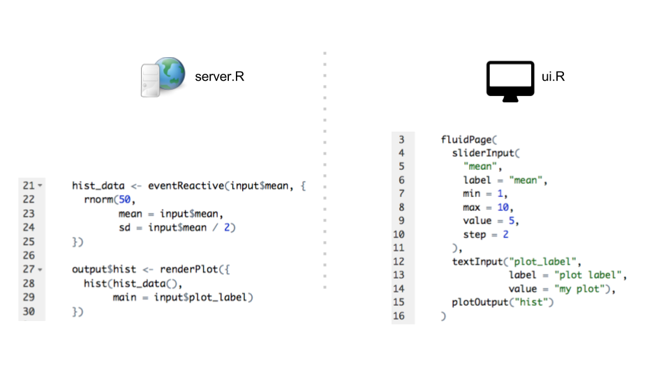</center>

# React to event

<center>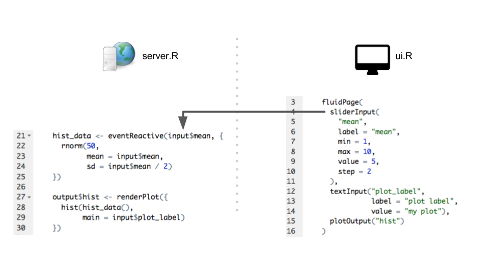</center>

# Call reactive expression

<center>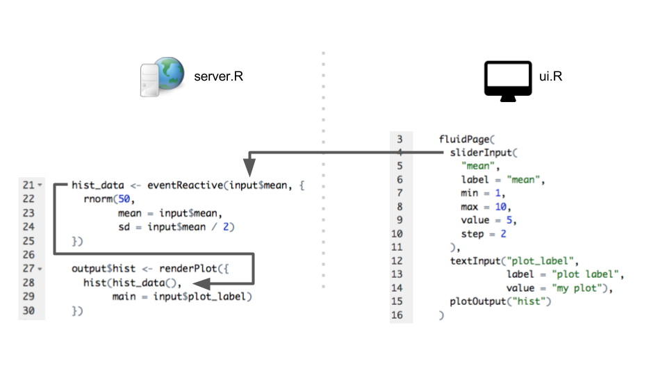</center>

# Output plot

<center>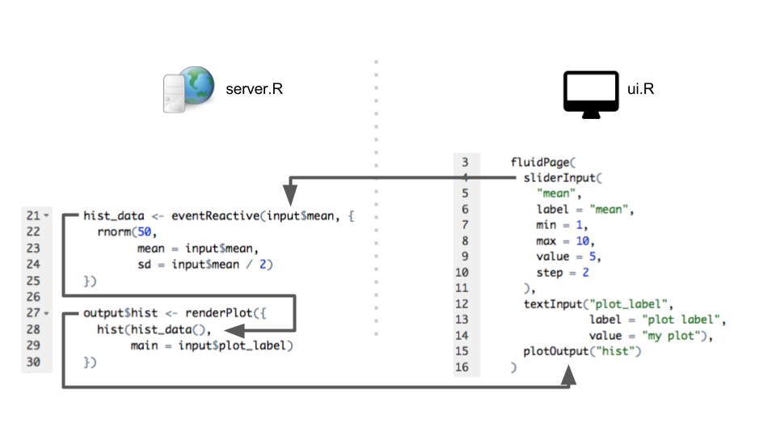</center>

# Standard renderPlot evaluation

<center>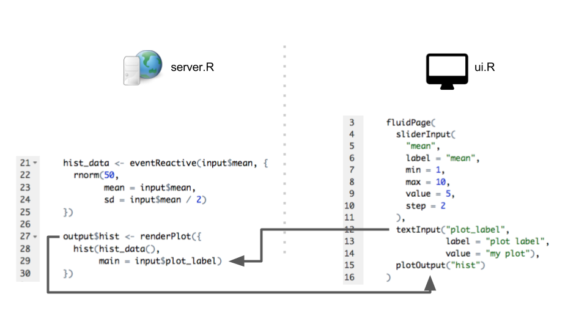</center>

# Summary of reactive expressions

We have just covered the function `eventReactive` which is incredibly useful for where an object (data) should be updated when specific `input$` variables change.

There are a few other `*Reactive` functions, but most things can be achieved with `eventReactive` and it is most similar to the `render*` functions.

Reactive expressions **must** be called as objects, i.e.

```{r, eval=F}
hist_data <- eventReactive(input$mean,
                               {
                                 rnorm(50, 
                 mean = input$mean, 
                 sd = input$mean / 2)
                               })

output$data_mean <- renderText(
  hist_data <- hist_data()
  
  mean(hist_data)
)
```

# Exercises 20mins (reactivity)

# Controls dependent on data

Often you will want to have a control in a shiny app that allows you to filter between the categories within your data.

We're going to look at how to build the following Shiny app - the control labelled "Selected regions" contains all of the regions within the data file and is therefore generated server-side.

Of course, to start off we're going to create a new project!

```{r, echo=FALSE, message=FALSE, warning=FALSE}
library(readr)
capital_cities <- read_csv("data/capitals_with_locations.csv")

library(leaflet)
library(shiny)
library(dplyr)

regions = list(
  "Europe", 
  "Asia", 
  "North and South America" = "America", 
  "Africa", 
  "Pacific", 
  "Australia", 
  "Atlantic", 
  "Indian Ocean" = "Indian")

shinyApp(
  ui = fluidPage(sidebarLayout(
    sidebarPanel(
      selectInput(
        "map_tiles",
        label = "Map Type",
        choices = c("OpenStreetMap", "Stamen.Toner")
      ),
      uiOutput("regions_ui")
    ),
    mainPanel(leafletOutput("capitals_map"))
  )),
  
  server = function(input, output, session) {
    output$regions_ui <- renderUI({
      selectInput(
        "selected_regions",
        label = "Selected regions",
        choices = regions,
        multiple = TRUE,
        selected = regions
      )
    })
    
    capitals_data <- eventReactive(
      input$selected_regions,
      capital_cities %>%
        filter(region %in% input$selected_regions)
    )
    
    output$capitals_map <- renderLeaflet({
      map <- leaflet() %>%
        addProviderTiles(input$map_tiles)
      
      if (is.null(input$selected_regions)) {
        map
      } else {
        map %>%
          addCircleMarkers(data = capitals_data(), popup = ~ Capital)
      }
    })
    
  }
)


```

# Capital cities import

Included in the exercise files is a data file called "capitals_with_locations.csv", create a folder in your project directory called "data" and move the file there.

The following code imports the data:

```{r, eval=F}
library(readr)
capital_cities <- read_csv("data/capitals_with_locations.csv")
```

# Filtering capitals by region

Using dplyr it is very simple to filter the capital cities by region:

```{r, message=FALSE, warning=FALSE}
capital_cities %>%
        filter(region %in% c("Pacific", "Australia"))
```

# Shiny skeleton

Within the exercise folder is a directory called "shiny_renderUI" which we're going to build into something like the app above.

There are a few things for us to fix:

>- Get the shiny app to work
>- Display appropriate names for all possible regions
>- Modify the app to generate the list of regions from the data set

# Named options for Shiny apps

Often it is useful to rename options in a pulldown menu, which is achieved using lists

```{r, eval=F}
selectInput("selected",
                label = "Options",
                choices = list("Great Britain" = "England, Scotland and Wales",
                               "United Kingdom" = "England, Scotland, Wales and Northern Ireland",
                               "None complicated region"))
```

```{r, eval=F}
output$selected_element <- renderText({
      input$selected
    })
```

```{r, echo = FALSE}
shinyApp(
  ui = fluidPage(
    selectInput("selected",
                label = "Options",
                choices = list("Great Britain" = "England, Scotland and Wales",
                               "United Kingdom" = "England, Scotland, Wales and Northern Ireland",
                               "None complicated region")),
    verbatimTextOutput("selected_element")
  ),
  server = function(input, output){
    output$selected_element <- renderText({
      input$selected
    })
  }
)
```

# renderUI Overview

<center>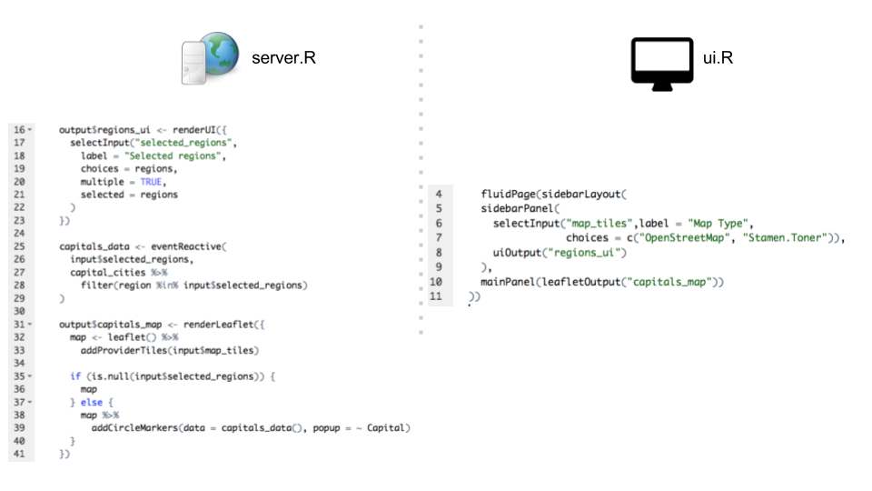</center>

# uiOutput

<center>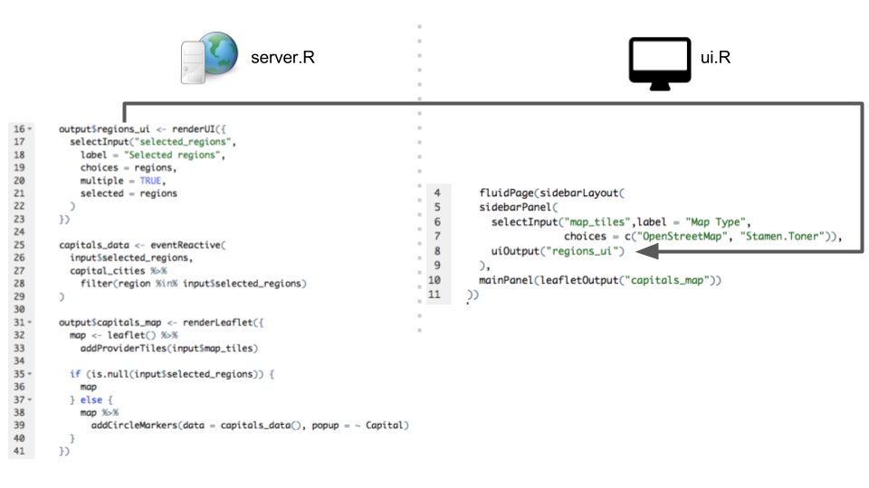</center>

# eventReactive

<center>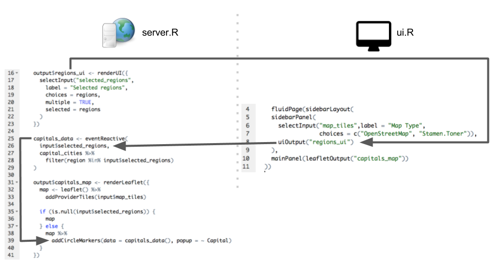</center>

# renderUI Round Trip

<center>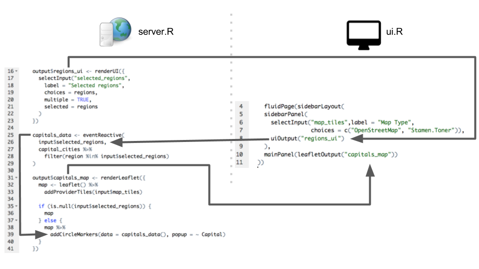</center>

# Range Slider

One last type of control I'd like to discuss is the range slider, after introducing this to you I would like you to add one to your shiny app we just built and deploy to shinyapps.io

```{r}
shinyApp(
  ui = fluidPage(
    sliderInput("number_range",
                label = "number Range",
                min = 1,
                max = 10,
                value = c(2, 6)
                ),
    uiOutput("number_range_values")
  ),
  server = function(input, output){
    output$number_range_values <- renderUI({
      wellPanel(
        p(paste("min:",input$number_range[1])),
      p(paste("max:",input$number_range[2]))
      )
    })
  }
)
```

# Exercises 20 mins (renderUI)


